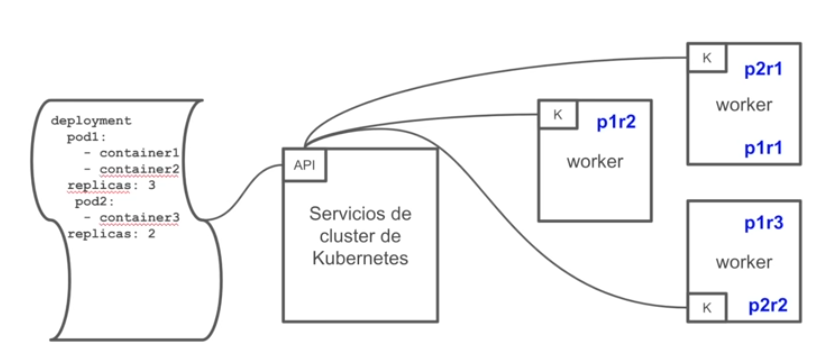
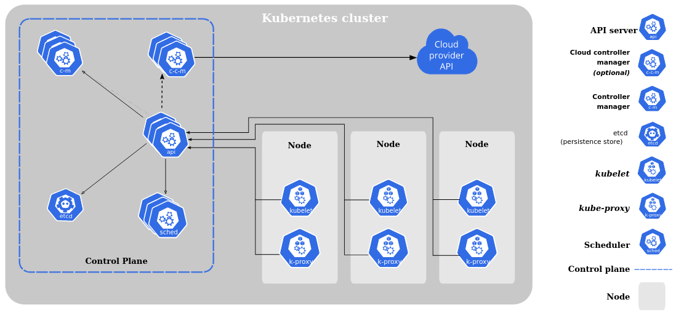
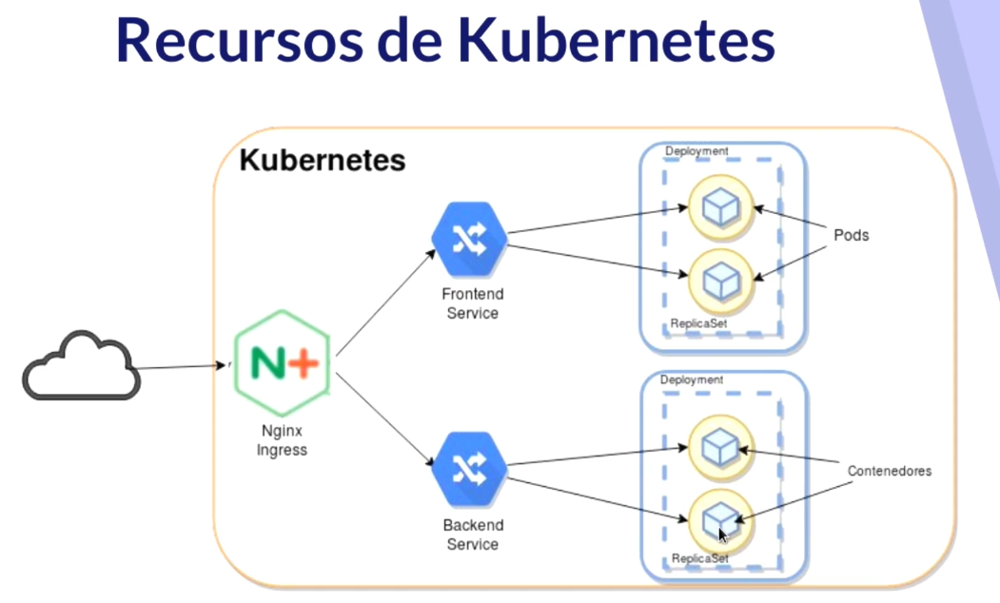

# Guía-Tutorial Kubernetes 🚀

## Guías 👀

[01 Instalación kubctl](guias/01-kubectl.md) --> [02 Clústers](guias/02-clusters.md) --> [03 manifiestos](guias/03-manifiestos.md) --> [04 Cheatsheet kubernetes](guias/04-cheatsheet.md) --> [05 Helm: Control de despliegues en Kubernetes](guias/05-helm.md) --> [06 K9s: Otro estilo de CLI para k8s](guias/06-k9s.md)

**Índice** 📎

- [Guía-Tutorial Kubernetes 🚀](#guía-tutorial-kubernetes-)
  - [Guías 👀](#guías-)
  - [¿Qué es Kubernetes? 🚢](#qué-es-kubernetes-)
  - [Componentes](#componentes)
  - [Recursos Kubernetes](#recursos-kubernetes)
  - [Ejemplo de ficheros YAML](#ejemplo-de-ficheros-yaml)
- [Agradecimientos 🎁](#agradecimientos-)
- [Invítame a un café ☕️](#invítame-a-un-café-️)

## ¿Qué es Kubernetes? 🚢

- Explicación más extendida en la web: [Kubernetes: Una breve introducción](https://vergaracarmona.es/kubernetes-una-breve-introduccion/)
- 30daysOfKubernetes [ENG] [Repo](https://github.com/AmanPathak-DevOps/30DaysOfKubernetes)

<details>
  <summary>Artículos #30DaysOfKubernetes [ENG]</summary>
  
  - Day 1 - [Unlocking the Power of Kubernetes: Day 01](https://medium.com/devops-dev/unlocking-the-power-of-kubernetes-day-01-315b367f618d)
  - Day 2 - [Kubernetes Architecture Part-1](https://blog.devops.dev/day02-kubernetes-architecture-part-1-c09abee5b1f2)
  - Day 3 - [Worker Node — The Heart of Container Management Part-2](https://blog.devops.dev/day-03-worker-node-the-heart-of-container-management-42d7a062a218)
  - Day 4 - [Setting up Minikube on Your Local Machine or AWS Instance](https://medium.com/devops-dev/day-04-setting-up-minikube-on-your-local-machine-or-aws-instance-620a4cb57abc)
  - Day 5 - [Kubeconfig, Services, and Deployments Files Explained](https://blog.devops.dev/day05-kubeconfig-services-and-deployments-files-explained-8733c0cd8b61)
  - Day 6 - [Deploying Your First Node.js Application on Kubernetes Cluster](https://blog.devops.dev/day06-deploying-your-first-node-js-application-on-kubernetes-cluster-eaabb19bb9fe)
  - Day 7 - [Mastering Kubernetes Labels, Selectors, and Node Selectors](https://blog.devops.dev/day07-mastering-kubernetes-labels-selectors-and-node-selectors-3df0293b7336)
  - Day 8 - [ReplicationController & ReplicaSet](https://medium.com/devops-dev/day08-replicationcontroller-replicaset-a0c6f9d98196)
  - Day 9 - [Deployment Object in Kubernetes](https://blog.devops.dev/day09-deployment-object-in-kubernetes-30b0022bc4ae)
  - Day 10 - [Setting up a Kubernetes Cluster using kubeadm on AWS EC2 Instances](https://blog.devops.dev/setting-up-a-kubernetes-cluster-master-worker-node-using-kubeadm-on-aws-ec2-instances-ubuntu-22-04-3432859b943b)
  - Day 11 - [Kubernetes Networking (Services)](https://blog.devops.dev/day11-kubernetes-networking-services-6fb913b059d0)
  - Day 12 - [Kubernetes Advanced Networking: CNI and Calico](https://blog.devops.dev/day12-kubernetes-advanced-networking-cni-and-calico-ee96734c17bb)
  - Day 13 - [Kubernetes volumes and liveness probes](https://blog.devops.dev/day13-kubernetes-volumes-and-liveness-probes-ea278ff9bb0f)
  - Day 14 - [ConfigMaps & Secrets](https://blog.devops.dev/day14-configmaps-secrets-1abb910aeb53)
  - Day 15 - [Kubernetes Jobs](https://blog.devops.dev/day15-kubernetes-jobs-bd18f55cf1be)
  - Day 16 - [Kubernetes InitContainer](https://blog.devops.dev/day16-kubernetes-initcontainer-a9df403934ff)
  - Day 17 - [Kubernetes Pod Lifecycle](https://blog.devops.dev/day17-kubernetes-pod-lifecycle-3a53566421b1)
  - Day 18 - [Kubernetes Resource Quota and Namespace](https://medium.com/@aman.pathak_51134/day18-kubernetes-resource-quota-and-namespace-6a21045b0d97)
  - Day 19 - [Kubernetes AutoScaling](https://blog.devops.dev/day19-kubernetes-autoscaling-da9da2c1d983)
  - Day 20 — [Mastering Multi-Cluster Kubernetes with HAProxy](https://blog.devops.dev/day-20-mastering-multi-cluster-kubernetes-with-haproxy-be63b08a4ec7)
  - Day21 - [Kubernetes Ingress](https://medium.com/@aman.pathak_51134/day21-kubernetes-ingress-f5dddf1599bc)
  - Day22 - [Kubernetes StatefulSets](https://blog.devops.dev/day21-kubernetes-statefulsets-2ecf9ca2c5fc)
  - Day 23 - [Kubernetes DaemonSet](https://medium.com/devops-dev/day-23-kubernetes-daemonset-cbca1ce3d4c1)
  - Day 24 - [Exploring Kubernetes Network Policies](https://blog.devops.dev/day-24-exploring-kubernetes-network-policies-0d8e687ff850)
  - Day 25 - [Kubernetes Operators](https://blog.devops.dev/day-25-kubernetes-operators-d67c8c2ad644)
  - Day 26 - Chapter 1 - [Kubernetes Helm & Helm Charts](https://amanpathakdevops.medium.com/day-26-kubernetes-helm-helm-charts-chapter-1-46e23aba25e6)
  - Day 26 - Chapter 2 - [Deploy Flask Application using Helm Chart and many more features- Kubernetes](https://blog.devops.dev/day-26-chapter-2-deploy-flask-application-using-helm-chart-and-many-more-features-kubernetes-daf402b69e5c)
  - Day 27 - [AWS Elastic Kubernetes Service(EKS)](https://blog.devops.dev/day-27-aws-elastic-kubernetes-service-eks-3b917cafbf2e)
  - Day 28 - [Azure Kubernetes Service(AKS)](https://blog.devops.dev/day-28-azure-kubernetes-service-aks-353e09f2629c)
  - Day 29 - [Google Kubernetes Engine (GKE)](https://blog.devops.dev/day-29-google-kubernetes-engine-gke-b65dec4fe504)
  - Day 30 - [End-to-End Kubernetes Project with JFrog Artifactory](https://github.com/AmanPathak-DevOps/30DaysOfKubernetes/blob/master/Day30/README.md)

</details>
<br>

Kubernetes es un sistema de código libre para la automatización del despliegue, ajuste de escala y manejo de aplicaciones en contenedores que fue originalmente diseñado por Google y donado a la Cloud Native Computing Foundation (parte de la Linux Foundation). Soporta diferentes entornos para la ejecución de contenedores, incluido Docker y su misión es la orquestación de dichos contenedores.

Es declarativo.




## Componentes


- **etcd** - Guarda el estado de Kubernetes
- **servidor API** - Es un componente central y sirve a la API de Kubernetes utilizando JSON sobre HTTP, que proveen la interfaz interna y externa de Kubernetes.
- **Planificador** - Es el componente enchufable que selecciona sobre qué nodo deberá correr un pod sin planificar basado en la disponibilidad de recursos.
- **Administrador de controlador** - Es el proceso sobre el cual el núcleo de los controladores Kubernetes como DaemonSet y Replication se ejecuta.
- **Nodo** *(esclavo o worker)* - Es la máquina física (o virtual) donde los contenedores (flujos de trabajos) son desplegados. 
- **Kubelet** - Es responsable por el estado de ejecución de cada nodo, es decir, asegurar que todos los contenedores en el nodo se encuentran saludables.
- **kube proxy** - Reenvía el tráfico al pod donde tiene que ir.
- **cloud controler manager** - Es el encargado de conectarse a la API del cloud. <u>Es la diferencia con otros orquestadores</u>. Permite correr los contenedores y hacer funciones extras que no estén instaladas en nuestro espacio.
- **cAdvisor** - Es un agente que monitorea y recoge métricas de utilización de recursos y rendimiento como CPU, memoria, uso de archivos y red de los contenedores en cada nodo. 

No es buena idea correr tráfico de clusterización en equipos personales.


---
## Recursos Kubernetes



Los **Pods** son los contenedores de Kubernetes (puede tener varios contenedores). La unidad mínima de computación. Comparte una única IP. Generalmente por cada pod correrá un contenedor, pero puede darse las circunstancias de que sea preferente correr varios contenedores en un pod.

**ReplicaSet** son quienes se aseguran que los contenedores siempre se están ejecutando. Asegura
- Que no haya caída del servicio
- Tolerancia a errores
- Escalabilidad dinámica

**Deployment** es responsable de las actualizaciones de los contenedores y despliegues automáticos de la aplicación.. Maneja los ReplicaSets.

Los **servicios** permiten los accesos a la aplicación.

**Ingress** es un proxy inverso que se comunica con los servicios y nos da la posibilidad de tener un nombre DNS, balanceo de carga entre pods...

Los **namespace** son clusters virtuales respaldados por el mismo clúster físico.

---
## Ejemplo de ficheros YAML 

Utilizaremos un pod con busybox.

```yaml
apiVersion: v1
kind: Pod
metadata:
  name: busybox
spec:
  containers:
  - image: busybox:1.28.4
    command:
      - sleep
      - "3600"
    name: busybox
  restartPolicy: Always
```
Crear un *pod*
```shell
kubectl create -f busybox.yaml
```
Crear un *deployment*
```shell
kubectl run nginx --image=nginx
```
Crear un *service* a partir del *deployment* anterior
```shell
kubectl expose deployment nginx --port=80 --type=NodePort
```
Para darle persistencia a los datos utilizaremos un *YAML* para un *volumen persistente* simple usando el almacenamiento local del nodo:
```yaml
apiVersion: v1
kind: PersistentVolume
metadata:
  name: data-pv
  namespace: web
spec:
  storageClassName: local-storage
    capacity:
      storage: 1Gi
    accessModes:
    - ReadWriteOnce
    hostPath:
      path: /mnt/data
```
Crear un *volumen persistente*.
```shell
kubectl apply -f my-pv.yaml
```
Podemos darle configuración con el *YAML ConfigMap*.
```yaml
apiVersion: v1
kind: ConfigMap
metadata:
  name: my-config-map
data:
  myKey: 
    myValueanotherKey: anotherValue
```
Crear el *ConfigMap*
```shell
kubectl apply -f configmap.yaml
```
Guardaremos las contraseñas en un *YAML* tipo *secret*:
```yaml
apiVersion: v1
kind: Secret
metadata:
  name: my-secret
  stringData:
    myKey: myPassword
```
Crear el *secret*
```shell
kubectl apply -f secret.yaml
```
Aquí está el *YAML* para una *cuenta de servicio*
```yaml
apiVersion: v1
kind: ServiceAccount
metadata:
  name: acr
  namespace: default
secrets:
  - name: acr
```
Crear el *service account*
```shell
kubectl apply -f serviceaccount.yaml
```
---

Puedes empezar por la guía [01 Instalación kubctl](guias/01-kubectl.md).

Todas las guías:

- [01 Instalación kubctl](guias/01-kubectl.md) 
- [02 Clústers](guias/02-clusters.md) 
- [03 manifiestos](guias/03-manifiestos.md) 
- [04 Cheatsheet kubernetes](guias/04-cheatsheet.md) 
- [05 Helm: Control de despliegues en Kubernetes](guias/05-helm.md) 
- [06 K9s: Otro estilo de CLI para k8s](guias/06-k9s.md)

---

<br><br>

# Agradecimientos 🎁

Esta guía ha sido creada a partir de multitud de tutoriales que he hecho, son mis apuntes personales. Pero quiero hacer unas menciones especiales a: 
- [**Pelado Nerd**](https://www.youtube.com/c/PeladoNerd). Espero que la guía sea como el Pelado manda.
- [**Prefapp**](https://prefapp.es/). De donde he folkeado el [tutorial de helm](https://github.com/prefapp/formacion/blob/master/cursos/kubernetes/03_configuracion/07_Helm.md).

<br>

# Invítame a un café ☕️

<p>
<a href="https://www.buymeacoffee.com/manuelver"> </a>
</p>

<br><br><br>
[Manu](https://vergaracarmona.es) 😊
