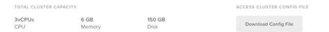

# Guía Kubernetes

Kubernetes es un sistema de código libre para la automatización del despliegue, ajuste de escala y manejo de aplicaciones en contenedores que fue originalmente diseñado por Google y donado a la Cloud Native Computing Foundation (parte de la Linux Foundation). Soporta diferentes entornos para la ejecución de contenedores, incluido Docker y su misión es la orquestación de dichos contenedores.

Es declarativo.


## Componentes


- **etcd** - Guarda el estado de Kubernetes
- **servidor API** - Es un componente central y sirve a la API de Kubernetes utilizando JSON sobre HTTP, que proveen la interfaz interna y externa de Kubernetes.
- **Planificador** - Es el componente enchufable que selecciona sobre qué nodo deberá correr un pod sin planificar basado en la disponibilidad de recursos.
- **Administrador de controlador** - Es el proceso sobre el cual el núcleo de los controladores Kubernetes como DaemonSet y Replication se ejecuta.
- **Nodo** *(esclavo o worker)* - Es la máquina física (o virtual) donde los contenedores (flujos de trabajos) son desplegados. 
- **Kubelet** - Es responsable por el estado de ejecución de cada nodo, es decir, asegurar que todos los contenedores en el nodo se encuentran saludables.
- **kube proxy** - Reenvía el tráfico al pod donde tiene que ir.
- **cloud controler manager** - Es el encargado de conectarse a la API del cloud. <u>Es la diferencia con otros orquestadores</u>. Permite correr los contenedores y hacer funciones extras que no estén instaladas en nuestro espacio.
- **cAdvisor** - Es un agente que monitorea y recoge métricas de utilización de recursos y rendimiento como CPU, memoria, uso de archivos y red de los contenedores en cada nodo. 

No es buena idea correr tráfico de clusterización en equipos personales.


---
## Recursos Kubernetes


Los **Pods** son los contenedores de Kubernetes (puede tener varios contenedores). La unidad mínima de computación. Comparte una única IP.

**ReplicaSet** son quienes se aseguran que los contenedores siempre se están ejecutando. Asegura
- Que no haya caída del servicio
- Tolerancia a errores
- Escalabilidad dinámica

**Deployment** es responsable de las actualizaciones de los contenedores y despliegues automáticos de la aplicación.. Maneja los ReplicaSets.

Los **servicios** permiten los accesos a la aplicación.

**Ingress** es un proxy inverso que se comunica con los servicios y nos da la posibilidad de tener un nombre DNS, balanceo de carga entre pods...

Los **namespace** son clusters virtuales respaldados por el mismo clúster físico.


---
## Instalación

Lo primero es instalar kubectl.

*Documentación oficial: https://kubernetes.io/docs/tasks/tools/install-kubectl-linux/*

Descargamos los paquetes.
```
curl -LO "https://dl.k8s.io/release/$(curl -L -s https://dl.k8s.io/release/stable.txt)/bin/linux/amd64/kubectl"
```
Descargamos validador kubectl checksum:
```
curl -LO "https://dl.k8s.io/$(curl -L -s https://dl.k8s.io/release/stable.txt)/bin/linux/amd64/kubectl.sha256"
```
Comprobamos
```
echo "$(cat kubectl.sha256)  kubectl" | sha256sum --check
```


Ahora ya podemos instalar
```
sudo install -o root -g root -m 0755 kubectl /usr/local/bin/kubectl
```
Para asegurarnos de que tenemos una versión actualizada:
```
kubectl version --client=true
```
En *Windows*, con Docker Desktop podemos activar kubernetes.

En **Linux**, podemos instalar kind https://kind.sigs.k8s.io/
También podemos instalar minikube https://minikube.sigs.k8s.io/docs/ que instala todos los componentes de kubernetes en una MV y además tiene una serie de plugins para darle funcionalidades con una serie de paquetes precinfigurados.

En esta guía utilizaré [DigitalOcean](https://m.do.co/c/98c9ca613f37), 3 nodos kubernetes de los baratitos.

Para conectar kubectl con el cluster de kubernetes se debe desarcargar el fichero kubeconfig que es donde están declarados los contextos de kubernetes. Es una combinación de la url del servidor con las credenciales de lo que se haya instalado. 



Se exporta en una variable de entorno
```
export KUBECONFIG=~/downloads/k8s-1-20..............
```
Y podremos comprobar los nodos con
```
kubectl get nodes
```

Para verlo con colores se puede usar un plugin que se llama *kubecolors*

Se puede ver la ayuda del cliente con 
```
kubectl --help
```
El comando que más se tuiliza es `get`.


Una herramienta gráfica excelente es *lens*, que muestra los contenedores de una manera clara.


---
## Cheatsheet kubernetes

### Visualizar información de los recursos
#### Nodes
```
kubectl get no

kubectl get no -o wide

kubectl describe no

kubectl get no -o yaml

kubectl get node –select or =[ label _name]

kubectl get nodes -o jsonpath='{.items[*].status.addresses[?(@.type==”ExternalIP”)].address}’

kubectl top node [node_name]
```
#### ods
```
kubectl get po

kubectl get po -o wide

kubectl describe po

kubectl get po –show-labels

kubectl get po -l app=nginx

kubectl get po -o yaml

kubect l get pod [ pod_name] -o yaml –export

kubect l get pod [pod_name] -o yaml –export > nameoffile.yaml

kubectl get pods –field-selector status.phase=Running
```
#### Namespaces
```
kubectl get ns

kubectl get ns -o yaml

kubectl describe ns
```
#### Deployments
```
kubectl get deploy

kubectl describe deploy

kubectl get deploy -o wide

kubectl get deploy -o yam
```
#### Services
```
kubectl get svc

kubectl describe svc

kubectl get svc -o wide

kubectl get svc -o yaml

kubectl get svc –show-labels
```
#### DaemonSets
```
kubectl get ds

kubectl get ds –all-namespaces

kubectl describe ds [daemonset _name] -n [namespace_name]

kubectl get ds [ds_name] -n [ns_name] -o yaml
```
#### Events
```
kubectl get events

kubectl get events -n kube-system

kubectl get events -w
```
#### Logs
```
kubectl logs [pod_name]

kubectl logs –since=1h [pod_name]

kubectl logs –tail =20 [pod_name]

kubectl logs -f -c [container_name] [pod_name]

kubectl logs [pod_name] > pod.log
```
#### Service Accounts
```
kubectl get sa

kubectl get sa -o yaml

kubectl get serviceaccounts default -o yaml > ./sa.yaml

kubectl replace serviceaccount default -f. /sa.yaml
```
#### ReplicaSets
```
kubectl get rs

kubectl describe rs

kubectl get rs -o wide

kubectl get rs -o yaml
```
#### Roles
```
kubectl get roles –all-namespaces

kubectl get roles –all-namespaces -o yaml
```
#### Secrets
```
kubectl get secrets

kubectl get secrets –all-namespaces

kubectl get secrets -o yaml
```
#### ConfigMaps
```
kubectl get cm

kubectl get cm –all-namespaces

kubectl get cm –all-namespaces -o yaml
```
#### Ingress
```
kubectl get ing

kubectl get ing –all-namespaces
```
#### PersistentVolume
```
kubectl get pv

kubectl describe pv
```
#### PersistentVolumeClaim
```
kubectl get pvc

kubectl describe pvc
```
#### StorageClass
```
kubectl get sc

kubectl get sc -o yaml
```
#### MultipleResources
```
kubectl get svc, po

kubectl get deploy, no

kubectl get all

kubectl get all –all-namespaces
```
### Modificar atributos de los recursos
#### Taint
```
kubectl taint [node_name] [taint _name]
```
#### Labels
```
kubectl label [node_name] disktype=ssd

kubrectl label [pod_name] env=prod
```
#### Cordon/Uncordon
```
kubectl cordon [node_name]

kubectl uncordon [node_name]
```
#### Drain
```
kubectl drain [node_name]
```
#### Nodes/Pods
```
kubectl delete node [node_name]

kubectl delete pod [pod_name]

kubectl edit node [node_name]

kubectl edit pod [pod_name]
```
#### Deployments/Namespaces
```
kubectl edit deploy [deploy_name]

kubectl delete deploy [deploy_name]

kubectl expose deploy [depl oy_name] –port=80 –type=NodePort

kubectl scale deploy [deploy_name] –replicas=5

kubectl delete ns

kubectl edit ns [ns_name]
```
#### Services
```
kubectl edit svc [svc_name]

kubectl delete svc [svc_name]
```
#### DaemonSets
```
kubectl edit ds [ds_name] -n kube-system

kubectl delete ds [ds_name]
```
#### ServiceAccounts
```
kubectl edit sa [sa_name]

kubectl delete sa [sa_name]
```
#### Annotate
```
kubectl annotate po [pod_name] [annotation]

kubectl annotate no [node_name]
```
### Añadir recursos
#### Crear Pod
```
kubectl create -f [name_of _file]

kubectl apply -f [name_of _file]

kubectl run [pod_name] –image=ngi nx –restart=Never

kubectl run [ pod_name] –generator =run-pod/v1 –image=nginx

kubectl run [ pod_name] –image=nginx –restart=Never
```
#### Crear un Service
```
kubectl create svc nodeport [svc_name] –tcp=8080:80
```
#### Crear Deployment
```
kubectl create -f [name_of _file]

kubectl apply -f [name_of _file]

kubectl create deploy [deploy_name] –image=ngi nx
```
#### Interactive Pod
```
kubectl run [pod_name] –image=busybox –rm -it –restart=Never — sh
```
#### Salida de YAMLto en un fichero
```
kubectl create deploy [deploy_name] –image=ngi nx –dry-run -o yaml > deploy.yaml

kubectl get po [pod_name] -o yaml –export > pod. yaml
```
#### Ayuda
```
kubectl -h

kubectl create -h

kubectl run -h

kubectl explain deploy.spec
```
### Solicitaciones
#### Llamar a la API
```
kubectl get –raw /apis/metrics.k8s.io/
```
#### Información del Cluster
```
kubectl config

kubectl cluster -info

kubectl get componentstatuses
```


---
## Ejemplo de un YAML para un pod básico de busybox
```
apiVersion: v1kind: Podmetadata:name: busyboxspec:containers:- image: busybox:1.28.4command:- sleep- "3600"name: busyboxrestartPolicy: Always
```
Crear un *pod*
```
kubectl create -f busybox.yaml
```
Crear un *deployment*
```
kubectl run nginx --image=nginx
```
Crear un *service* a partir del *deployment* anterior
```
kubectl expose deployment nginx --port=80 --type=NodePort
```
Aquí está el *YAML* para un *volumen persistente* simple usando el almacenamiento local del nodo:
```
apiVersion: v1kind: PersistentVolumemetadata:name: data-pvnamespace: webspec:storageClassName: local-storagecapacity:storage: 1GiaccessModes:- ReadWriteOncehostPath:path: /mnt/data
```
Crear un *volumen persistente*
```
kubectl apply -f my-pv.yaml
```
Aquí está el *YAML* para un *ConfigMap* simple
```
apiVersion: v1kind: ConfigMapmetadata:name: my-config-mapdata:myKey: myValueanotherKey: anotherValue
```
Crear el *ConfigMap*
```
kubectl apply -f configmap.yaml
```
Aquí está el *YAML* para los *secret*:
```
apiVersion: v1kind: Secretmetadata:name: my-secretstringData:myKey: myPassword
```
Crear el *secret*
```
kubectl apply -f secret.yaml
```
Aquí está el *YAML* para una *cuenta de servicio*
```
apiVersion: v1kind: ServiceAccountmetadata:name: acrnamespace: defaultsecrets:- name: acr
```
Crear el *service account*
```
kubectl apply -f serviceaccount.yaml
```