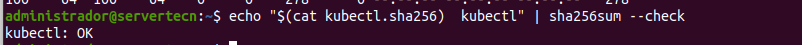
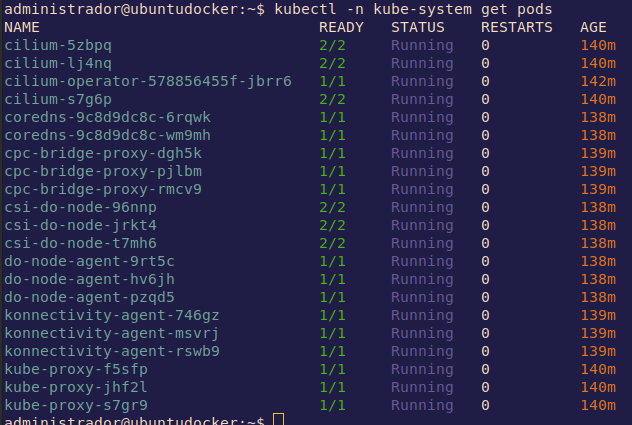
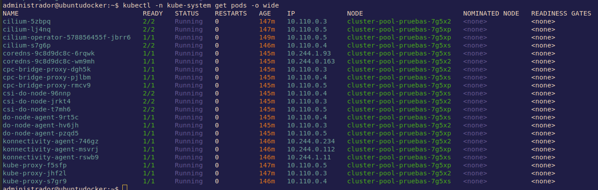

# Índice 📎
- [Índice 📎](#índice-)
- [Guía Kubernetes 👓](#guía-kubernetes-)
  - [Componentes 🧩](#componentes-)
  - [Recursos Kubernetes 🛞](#recursos-kubernetes-)
  - [Instalación kubctl y primeros pasos 🚀](#instalación-kubctl-y-primeros-pasos-)
    - [kind](#kind)
    - [minikube](#minikube)
    - [MicroK8s](#microk8s)
      - [Instalación MicroK8s](#instalación-microk8s)
      - [Unirse al grupo](#unirse-al-grupo)
      - [Comprobar estado](#comprobar-estado)
      - [Acceso a Kubernetes](#acceso-a-kubernetes)
      - [Desplegar una aplicación](#desplegar-una-aplicación)
      - [Utilizar complementos](#utilizar-complementos)
      - [Iniciando y deteniendo MicroK8s](#iniciando-y-deteniendo-microk8s)
    - [Digital Ocean](#digital-ocean)
    - [Resultados de kubectl con cololes: kubecolors](#resultados-de-kubectl-con-cololes-kubecolors)
    - [Resumen conexión de cluster Digital Ocean](#resumen-conexión-de-cluster-digital-ocean)
    - [Ayuda de kubeclt](#ayuda-de-kubeclt)
  - [Ejemplo de un YAML para un pod básico de busybox 📃](#ejemplo-de-un-yaml-para-un-pod-básico-de-busybox-)
  - [Manifiestos de Pelado Nerd 📜](#manifiestos-de-pelado-nerd-)
    - [Manifiesto de POD](#manifiesto-de-pod)
    - [Otro Manifiesto de POD](#otro-manifiesto-de-pod)
    - [Manifiesto de Deployment](#manifiesto-de-deployment)
    - [Manifiesto de daemonset](#manifiesto-de-daemonset)
    - [Manifiesto de statefulset](#manifiesto-de-statefulset)
    - [Manifiesto cluster ip](#manifiesto-cluster-ip)
      - [Pod Networking](#pod-networking)
      - [Kube-proxy](#kube-proxy)
    - [Manifiesto nodeport](#manifiesto-nodeport)
    - [Manifiesto load balancer](#manifiesto-load-balancer)
    - [Manifiesto versiones e ingress](#manifiesto-versiones-e-ingress)
    - [Manifiesto configmap](#manifiesto-configmap)
    - [Manifiesto secret](#manifiesto-secret)
    - [Manifiesto kustomization](#manifiesto-kustomization)
    - [stern](#stern)
  - [Cheatsheet kubernetes 🔖](#cheatsheet-kubernetes-)
    - [Visualizar información de los recursos](#visualizar-información-de-los-recursos)
      - [Nodes](#nodes)
      - [ods](#ods)
      - [Namespaces](#namespaces)
      - [Deployments](#deployments)
      - [Services](#services)
      - [DaemonSets](#daemonsets)
      - [Events](#events)
      - [Logs](#logs)
      - [Service Accounts](#service-accounts)
      - [ReplicaSets](#replicasets)
      - [Roles](#roles)
      - [Secrets](#secrets)
      - [ConfigMaps](#configmaps)
      - [Ingress](#ingress)
      - [PersistentVolume](#persistentvolume)
      - [PersistentVolumeClaim](#persistentvolumeclaim)
      - [StorageClass](#storageclass)
      - [MultipleResources](#multipleresources)
    - [Modificar atributos de los recursos](#modificar-atributos-de-los-recursos)
      - [Taint](#taint)
      - [Labels](#labels)
      - [Cordon/Uncordon](#cordonuncordon)
      - [Drain](#drain)
      - [Nodes/Pods](#nodespods)
      - [Deployments/Namespaces](#deploymentsnamespaces)
      - [Services](#services-1)
      - [DaemonSets](#daemonsets-1)
      - [ServiceAccounts](#serviceaccounts)
      - [Annotate](#annotate)
    - [Añadir recursos](#añadir-recursos)
      - [Crear Pod](#crear-pod)
      - [Crear un Service](#crear-un-service)
      - [Crear Deployment](#crear-deployment)
      - [Interactive Pod](#interactive-pod)
      - [Salida de YAMLto en un fichero](#salida-de-yamlto-en-un-fichero)
      - [Ayuda](#ayuda)
    - [Solicitaciones](#solicitaciones)
      - [Llamar a la API](#llamar-a-la-api)
      - [Información del Cluster](#información-del-cluster)
    - [Resumen en una imagen](#resumen-en-una-imagen)
  - [Agradecimientos 🎁](#agradecimientos-)


# Guía Kubernetes 👓

Kubernetes es un sistema de código libre para la automatización del despliegue, ajuste de escala y manejo de aplicaciones en contenedores que fue originalmente diseñado por Google y donado a la Cloud Native Computing Foundation (parte de la Linux Foundation). Soporta diferentes entornos para la ejecución de contenedores, incluido Docker y su misión es la orquestación de dichos contenedores.

Es declarativo.


## Componentes 🧩


- **etcd** - Guarda el estado de Kubernetes
- **servidor API** - Es un componente central y sirve a la API de Kubernetes utilizando JSON sobre HTTP, que proveen la interfaz interna y externa de Kubernetes.
- **Planificador** - Es el componente enchufable que selecciona sobre qué nodo deberá correr un pod sin planificar basado en la disponibilidad de recursos.
- **Administrador de controlador** - Es el proceso sobre el cual el núcleo de los controladores Kubernetes como DaemonSet y Replication se ejecuta.
- **Nodo** *(esclavo o worker)* - Es la máquina física (o virtual) donde los contenedores (flujos de trabajos) son desplegados. 
- **Kubelet** - Es responsable por el estado de ejecución de cada nodo, es decir, asegurar que todos los contenedores en el nodo se encuentran saludables.
- **kube proxy** - Reenvía el tráfico al pod donde tiene que ir.
- **cloud controler manager** - Es el encargado de conectarse a la API del cloud. <u>Es la diferencia con otros orquestadores</u>. Permite correr los contenedores y hacer funciones extras que no estén instaladas en nuestro espacio.
- **cAdvisor** - Es un agente que monitorea y recoge métricas de utilización de recursos y rendimiento como CPU, memoria, uso de archivos y red de los contenedores en cada nodo. 

No es buena idea correr tráfico de clusterización en equipos personales.


---
## Recursos Kubernetes 🛞


Los **Pods** son los contenedores de Kubernetes (puede tener varios contenedores). La unidad mínima de computación. Comparte una única IP. Generalmente por cada pod correrá un contenedor, pero puede darse las circunstancias de que sea preferente correr varios contenedores en un pod.

**ReplicaSet** son quienes se aseguran que los contenedores siempre se están ejecutando. Asegura
- Que no haya caída del servicio
- Tolerancia a errores
- Escalabilidad dinámica

**Deployment** es responsable de las actualizaciones de los contenedores y despliegues automáticos de la aplicación.. Maneja los ReplicaSets.

Los **servicios** permiten los accesos a la aplicación.

**Ingress** es un proxy inverso que se comunica con los servicios y nos da la posibilidad de tener un nombre DNS, balanceo de carga entre pods...

Los **namespace** son clusters virtuales respaldados por el mismo clúster físico.


---
## Instalación kubctl y primeros pasos 🚀

Lo primero es instalar kubectl.

*Documentación oficial: https://kubernetes.io/docs/tasks/tools/install-kubectl-linux/*

Descargamos los paquetes.
```
curl -LO "https://dl.k8s.io/release/$(curl -L -s https://dl.k8s.io/release/stable.txt)/bin/linux/amd64/kubectl"
```
Descargamos validador kubectl checksum:
```
curl -LO "https://dl.k8s.io/$(curl -L -s https://dl.k8s.io/release/stable.txt)/bin/linux/amd64/kubectl.sha256"
```
Comprobamos
```
echo "$(cat kubectl.sha256)  kubectl" | sha256sum --check
```


Ahora ya podemos instalar
```
sudo install -o root -g root -m 0755 kubectl /usr/local/bin/kubectl
```
Para asegurarnos de que tenemos una versión actualizada.
```
kubectl version --client=true --output=yaml
```
Ponemos `--cliente=true` porque si no se intentaría conectar a un clúster kubernetes y trataría de descargar la versión kubernetes del clúster. Para un formato más legible controlamos la salida con `--output=yaml|json]`

### kind

En **Linux**, podemos instalar [kind](https://kind.sigs.k8s.io/)


[Guía de instalación de Kind](https://kind.sigs.k8s.io/docs/user/quick-start)

En Linux tan solo hay que usar los siguientes comandos:

```
curl -Lo ./kind https://kind.sigs.k8s.io/dl/v0.16.0/kind-linux-amd64
chmod +x ./kind
sudo mv ./kind /usr/local/bin/kind
```

Una vez instalado, la creación de un clúster es tan sencillo como este comando:

```
kind create cluster
```

Para listar los clústeres:

```sh
kind get clusters
```

Para eliminarlo:

```sh
kind delete cluster
```


### minikube
También podemos instalar minikube https://minikube.sigs.k8s.io/docs/ que instala todos los componentes de kubernetes en una MV y además tiene una serie de plugins para darle funcionalidades con una serie de paquetes precinfigurados.


### MicroK8s

MicroK8s instalará un Kubernetes mínimo y ligero que puede ejecutar y utilizar en prácticamente cualquier máquina.

[*Instalación microk8s*](https://microk8s.io/docs/getting-started)
#### Instalación MicroK8s
 Se puede instalar con un snap:

    sudo snap install microk8s --classic --channel=1.25

#### Unirse al grupo

MicroK8s crea un grupo para permitir el uso sin problemas de los comandos que requieren privilegios de administrador. Para añadir su usuario actual al grupo y obtener acceso al directorio de caché .kube, ejecute los siguientes dos comandos:

	sudo usermod -a -G microk8s $USER
	sudo chown -f -R $USER ~/.kube

También tendrá que volver a entrar en la sesión para que la actualización del grupo se lleve a cabo:

	su - $USER
Y se comprueba examinando los grupos de pertenencia del usuario:

	id -nG

#### Comprobar estado

MicroK8s tiene un comando incorporado para mostrar su estado. Durante la instalación puede utilizar el indicador --wait-ready para esperar a que los servicios de Kubernetes se inicialicen:
```
  microk8s status --wait-ready
```

#### Acceso a Kubernetes

MicroK8s incluye su propia versión de kubectl para acceder a Kubernetes. Utilícelo para ejecutar comandos para monitorear y controlar su Kubernetes. Por ejemplo, para ver su nodo:

	microk8s kubectl get nodes

...o para ver los servicios en ejecución:

	microk8s kubectl get services

MicroK8s utiliza un comando kubectl con espacio de nombre para evitar conflictos con cualquier instalación existente de kubectl. Si usted no tiene una instalación existente, es más fácil añadir un alias (añadir a ~/.bash_aliases) como este:

	alias kubectl='microk8s kubectl'

#### Desplegar una aplicación

Por supuesto, Kubernetes está pensado para desplegar aplicaciones y servicios. Puedes usar el comando kubectl para hacerlo como con cualquier Kuberenetes. Prueba a instalar una app de demostración:

	microk8s kubectl create deployment nginx --image=nginx

Puede tardar uno o dos minutos en instalarse, pero puedes comprobar el estado:

	microk8s kubectl get pods

#### Utilizar complementos

MicroK8s utiliza el mínimo de componentes para un Kubernetes puro y ligero. ¡Sin embargo, hay un montón de características adicionales disponibles con unas pocas pulsaciones de teclas utilizando "add-ons" - componentes pre-empaquetados que proporcionarán capacidades adicionales para su Kubernetes, desde la simple gestión de DNS hasta el aprendizaje automático con Kubeflow!

Para empezar se recomienda añadir la gestión de DNS para facilitar la comunicación entre servicios. Para las aplicaciones que necesitan almacenamiento, el complemento "storage" proporciona espacio de directorio en el host. Esto es fácil de configurar:

	microk8s enable dns storage

[Lista completa de complementos](https://microk8s.io/docs/addons#heading--list)

#### Iniciando y deteniendo MicroK8s

MicroK8s continuará funcionando hasta que usted decida detenerlo. Puede detener e iniciar MicroK8s con estos simples comandos:

	microk8s stop

... detendrá MicroK8s y sus servicios. Puede iniciar de nuevo en cualquier momento ejecutando

	microk8s start

Tenga en cuenta que **si deja MicroK8s funcionando, se reiniciará automáticamente después de un reinicio.** Si no quiere que esto ocurra, simplemente recuerde ejecutar microk8s stop antes de apagar.

### Digital Ocean
En esta guía utilizaré [DigitalOcean](https://m.do.co/c/98c9ca613f37), con 3 nodos kubernetes de los baratitos.


Para conectar kubectl con el cluster de kubernetes se debe desarcargar el fichero *kubeconfig* que es donde están declarados los contextos de kubernetes. Es una combinación de la url del servidor con las credenciales de lo que se haya instalado. 


*Con minikube no tendríamos que hacer nada porque se configura automáticamente.*

Se exporta en una variable de entorno
```
kubectl --kubeconfig=/<pathtodirectory>/k8s-1-24-4-do-0...........yaml get nodes
```
Y podremos comprobar los nodos con
```
kubectl get nodes
```


### Resultados de kubectl con cololes: kubecolors
Para verlo con colores se puede instalar el plugin de kubectl que se llama *[kubecolors](https://github.com/hidetatz/kubecolor)*

*En ubuntu:*
```
wget  http://archive.ubuntu.com/ubuntu/pool/universe/k/kubecolor/kubecolor_0.0.20-1_amd64.deb
```
```
sudo dpkg -i kubecolor_0.0.20-1_amd64.deb
```
```
sudo apt update && sudo apt install kubecolor -y

```
```
kubecolor --context=[tu_contexto] get pods -o json
```
```
kubecolor --context=do-ams3-k8s-1-24-4-do-0-ams3-..... get pods -o json
```
```
alias kubectl="kubecolor"
```


### Resumen conexión de cluster Digital Ocean
Para que tenga el color y todo
```
export KUBECONFIG=~/Downloads/k8s-1-20.... get nodes
```
Comprobamos
```
kubectl get nodes
```
Vemos el contexto
```
kubectl config get-contexts
```
Añadimos el contexto en el plugin del color
```
kubecolor --context=do-ams3-k8s-1-24-4-do-...... get pods -o json
```
Nos aseguramos del alias y volvemos a comprobar
```
alias kubectl="kubecolor"
```
```
kubectl get nodes
```

### Ayuda de kubeclt
Se puede ver la ayuda del cliente con 
```
kubectl --help
```


> *Trascripción traducida de la ayuda de kubectl*
```
kubectl controla el gestor de clústeres de Kubernetes.

Encontrará más información en: https://kubernetes.io/docs/reference/kubectl/

Comandos básicos (principiante):
  create          Crear un recurso desde un archivo o desde stdin
  expose          Tomar un controlador de replicación, servicio, despliegue o pod y exponerlo como un nuevo servicio Kubernetes
  run             Ejecutar una imagen particular en el cluster
  set             Establecer características específicas en los objetos

Comandos básicos (Intermedio):
  explain         Obtener la documentación de un recurso
  get             Mostrar uno o varios recursos
  edit            Editar un recurso en el servidor
  delete          Eliminar recursos por nombres de archivo, stdin, recursos y nombres, o por recursos y selector de etiqueta

Comandos de despliegue:
  rollout         Gestionar el despliegue de un recurso
  scale           Establecer un nuevo tamaño para un despliegue, conjunto de réplicas o controlador de replicación
  autoscale       Escala automáticamente un despliegue, un conjunto de réplicas, un conjunto con estado o un controlador de replicación

Comandos de gestión del clúster:
  certificate     Modificar los recursos del certificado.
  cluster-info    Mostrar información del cluster
  top             Mostrar el uso de recursos (CPU/memoria)
  cordon          Marcar un nodo como no programable
  uncordon        Marcar el nodo como programable
  drain           Drenar el nodo en preparación para el mantenimiento
  taint           Actualizar los taints de uno o más nodos

Comandos de solución de problemas y depuración:
  describe        Mostrar los detalles de un recurso específico o de un grupo de recursos
  logs            Imprimir los registros de un contenedor en un pod
  attach          Adjuntar a un contenedor en ejecución
  exec            Ejecutar un comando en un contenedor
  port-forward    Reenviar uno o más puertos locales a un pod
  proxy           Ejecutar un proxy al servidor de la API de Kubernetes
  cp              Copiar archivos y directorios hacia y desde los contenedores
  auth            Inspeccionar la autorización
  debug           Crear sesiones de depuración para la resolución de problemas de cargas de trabajo y nodos

Comandos avanzados:
  diff            Comparar una versión en vivo contra una versión aplicada
  apply           Aplicar una configuración a un recurso por nombre de archivo o stdin
  patch           Actualizar los campos de un recurso
  replace         Reemplazar un recurso por nombre de archivo o stdin
  wait            Experimental: Esperar una condición específica en uno o varios recursos
  kustomize       Construir un objetivo de kustomize a partir de un directorio o una URL.

Settings Commands:
  label           Actualizar las etiquetas de un recurso
  annotate        Actualiza las anotaciones de un recurso
  completion      Imprimir el código de finalización del shell para el shell especificado (bash, zsh, fish o powershell)

Otros Comandos:
  alpha           Comandos para funciones en alpha
  api-resources   Imprime los recursos de la API soportados en el servidor
  api-versions    Imprime las versiones de la API admitidas en el servidor, en forma de "grupo/versión"
  config          Modifica los archivos kubeconfig
  plugin          Proporciona utilidades para interactuar con los plugins
  version         Imprime la información de la versión del cliente y del servidor

Uso:
  kubectl [flags] [options]

Utilice "kubectl <command> --help" para obtener más información sobre un determinado comando.
Utilice "kubectl options" para obtener una lista de opciones globales de la línea de comandos (se aplica a todos los comandos).
```

Una herramienta gráfica para kubectl es *[lens](https://k8slens.dev/)*., Muestra los contenedores de una manera clara y también tiene gráficas (memoria, CPU, etc).

Para mostrar los contextos que están en el fichero kubeconfig o el archivo de configuración de kubectl
```
kubectl config get-contexts
```

Para mostrar los namespaces:
```
kubectl get ns
```
Con el clúster recien creado aparecerán los namespaces por defecto que vienen con cualquier clúster.


Para ver los pods que están corriendo
```
kubectl -n kube-system get pods
```


`kube-system` es un namespace que utiliza kubernetes para correr los pods de sistema.

Tomando un ejemplo, `do-node-agent-9rt5c` es un agente que corre DigitalOcean en sus nodos para hacer algún tipo de recolección de datos o monitoreo. El final alfanumérico es porque ha sido generado por el template de pods *deployment*, todos los pods tendrá ese hash en el nombre.

La segunda columna indica el número de pods activos y los que existen. El estado, está claro, después están las columnas de los reinicios efectuados y la de el tiempo que lleva arrancado.

Con la opción `-o wide` mostrará un poco más de información.



Vamos a probar lo que dicen de kubernetes de que si se borra un pod se creará uno nuevo. 
```
kubectl -n kube-system delete pod do-node-agent-9rt5c
```
Inmediatamente muestro los pods y se puede ver como lo está creando de nuevo.


El pod es nuevo, tiene otro hash. Así que esto asegura que siempre estén el mismo número de pods.


---
## Ejemplo de un YAML para un pod básico de busybox 📃
```
apiVersion: v1kind: Podmetadata:name: busyboxspec:containers:- image: busybox:1.28.4command:- sleep- "3600"name: busyboxrestartPolicy: Always
```
Crear un *pod*
```
kubectl create -f busybox.yaml
```
Crear un *deployment*
```
kubectl run nginx --image=nginx
```
Crear un *service* a partir del *deployment* anterior
```
kubectl expose deployment nginx --port=80 --type=NodePort
```
Aquí está el *YAML* para un *volumen persistente* simple usando el almacenamiento local del nodo:
```
apiVersion: v1kind: PersistentVolumemetadata:name: data-pvnamespace: webspec:storageClassName: local-storagecapacity:storage: 1GiaccessModes:- ReadWriteOncehostPath:path: /mnt/data
```
Crear un *volumen persistente*
```
kubectl apply -f my-pv.yaml
```
Aquí está el *YAML* para un *ConfigMap* simple
```
apiVersion: v1kind: ConfigMapmetadata:name: my-config-mapdata:myKey: myValueanotherKey: anotherValue
```
Crear el *ConfigMap*
```
kubectl apply -f configmap.yaml
```
Aquí está el *YAML* para los *secret*:
```
apiVersion: v1kind: Secretmetadata:name: my-secretstringData:myKey: myPassword
```
Crear el *secret*
```
kubectl apply -f secret.yaml
```
Aquí está el *YAML* para una *cuenta de servicio*
```
apiVersion: v1kind: ServiceAccountmetadata:name: acrnamespace: defaultsecrets:- name: acr
```
Crear el *service account*
```
kubectl apply -f serviceaccount.yaml
```


---
## Manifiestos de Pelado Nerd 📜
### Manifiesto de POD
Ahora utilizaremos un manifiesto de un pod del [pelado Nerd](https://github.com/pablokbs/peladonerd/tree/master/kubernetes/35) llamado [01-pod.ymal](yaml-del-pelado/01-pod.yaml)

```
apiVersion: v1
kind: Pod
metadata:
  name: nginx
spec:
  containers:
  - name: nginx
    image: nginx:alpine

```
Tendremos:
- La *versión de la API* de este recurso de kubernetes. Se debe extraer de la documentación de kubernetes.
- El *recurso*
- En *metadata* podemos poner algunos valores que identifiquen nuestro pod. Siempre tiene que tener un `name`.
- En las *especificaciones* declaramos los contenedores que corren. En este caso ponemos el nombre y la imagén en concreto.

Para aplicar este manifiesto
```
kubectl apply -f 01-pod.yaml
```
Si no especificamos un namespaces lo aplica en el que tenemos por defecto. Podremos mostrar que ya está corriendo.


Ahora, para correr un comando dentro del pod usaremos este comando
```
kubectl exec -it nginx -- sh
```
Con la misma opción de docker, `-it` nos permite que sea interactivo.


Para salir es con `CTRL+d`.

Borrar un pod
```
kubectl delete pod nginx
```
Como no se creo la orden para mantener siempre un pod, el pod desapareció. 

### Otro Manifiesto de POD

Otro manifiesto de un pod del [pelado Nerd](https://github.com/pablokbs/peladonerd/tree/master/kubernetes/35) llamado [02-pod.ymal](yaml-del-pelado/02-pod.yaml) es lo mismo pero con más opciones.

```
apiVersion: v1
kind: Pod
metadata:
  name: nginx
spec:
  containers:
  - name: nginx
    image: nginx:alpine
    env:
    - name: MI_VARIABLE
      value: "pelado"
    - name: MI_OTRA_VARIABLE
      value: "pelade"
    - name: DD_AGENT_HOST
      valueFrom:
        fieldRef:
          fieldPath: status.hostIP
    resources:
      requests:
        memory: "64Mi"
        cpu: "200m" # son milicores, cada core tiene 1000 milicores
      limits:
        memory: "128Mi"
        cpu: "500m" 
    readinessProbe:
      httpGet:
        path: /
        port: 80
      initialDelaySeconds: 5
      periodSeconds: 10
    livenessProbe:
      tcpSocket:
        port: 80
      initialDelaySeconds: 15
      periodSeconds: 20
    ports:
    - containerPort: 80
```

En este tenemos más especificaciones:
- *Variables de entorno* como clave-valor. Con `DD_AGENT_HOST` podemos pasar el valor de otro sitio gracias a *[Downward](https://kubernetes.io/docs/concepts/workloads/pods/downward-api/)* de kubernetes, que son valores que se pueden heredar, en este caso indicamos la ip del host donde va a correr este pod: `status.hostIP`.
- Se indican los recursos que se garantizan por contenedor con `requests` y los limites con `limits`. Los límites provocan que el kernel de Linux haga CPU Throttling, es decir, ahorcará el proceso hasta que use la velocidad límite y si no lo matará y esto hará que se cree otro pod.
- *ReadinessProbe* es una forma de explicarle a kubernetes de que el pod está preparado para recibir tráfico. Kubernetes comprueba la raíz esperando un status code 200.
- *livenessProbe*  es una forma de explicarle a kubernetes de que el pod está vivo y no quieres que lo mate. Kubernetes comprueba el socker del puerto 80 de que está vivo.
- Por último tenemos el *puerto* que queremos poner.

Vamos a correrlo
```
kubectl apply -f pelado_nerd_pruebas/kubernetes/35/02-pod.yaml
```
Podemos ver el estado del pod con
```
 kubectl get pod nginx
```
Y además veremos el yaml si le añadimos la opción `-o yaml` con todas las variables y parámetros por defecto que le ha añadido kubernetes.
```
 kubectl get pod nginx -o yaml
```
### Manifiesto de Deployment
Pero para trabajar con kubernetes, no deberíamos levantar el recurso mínimo como son los pods, es mejor aprocechar la capacidad de orquestación de la herramienta y levantar deployment. Lo encontraremos en otro manifiesto de un deployment del [pelado Nerd](https://github.com/pablokbs/peladonerd/tree/master/kubernetes/35) llamado [04-deployment.yaml](yaml-del-pelado/04-deployment.yaml).
```
apiVersion: apps/v1
kind: Deployment
metadata:
  name: nginx-deployment
spec:
  selector:
    matchLabels:
      app: nginx
  replicas: 2
  template:
    metadata:
      labels:
        app: nginx
    spec:
      containers:
      - name: nginx
        image: nginx:alpine
        env:
        - name: MI_VARIABLE
          value: "pelado"
        - name: MI_OTRA_VARIABLE
          value: "pelade"
        - name: DD_AGENT_HOST
          valueFrom:
            fieldRef:
              fieldPath: status.hostIP
        resources:
          requests:
            memory: "64Mi"
            cpu: "200m"
          limits:
            memory: "128Mi"
            cpu: "500m"
        readinessProbe:
          httpGet:
            path: /
            port: 80
          initialDelaySeconds: 5
          periodSeconds: 10
        livenessProbe:
          tcpSocket:
            port: 80
          initialDelaySeconds: 15
          periodSeconds: 20
        ports:
        - containerPort: 80

```

Es muy parecido al yaml de los pods pero especificando como una plantilla de pods en el `spec` dentro del `spec`.

Las réplicas son el número de pods que queremos dentro del deployment.

Aplicamos el manifiesto
```
kubectl apply -f 04-deployment.yaml
```
Y veremos como ha desplegado las 2 réplicas que se indica en el manifiesto.


Ahora sí que si borramos uno de los pods, como en el manifiesto indicamos 2 réplicas, kubernetes lo creará de nuevo.


Para borrar el deployment utilizaremos el mismo yaml con el que lo corrimos.
```
kubectl delete -f 04-deployment.yaml
```
### Manifiesto de daemonset
`daemonset` es otra forma de deployment un pod pero en este caso será un pod en cada uno de los nodos existente. No indicas las réplicas por eso. Sirve, por ejemplo, para despliegues de servicios de monitoreo. De nuevo, vamos a un manifiesto de un daemonset del [pelado Nerd](https://github.com/pablokbs/peladonerd/tree/master/kubernetes/35) llamado [03-daemonset.yaml](yaml-del-pelado/03-daemonset.yaml).
```
apiVersion: apps/v1
kind: DaemonSet
metadata:
  name: nginx-deployment
spec:
  selector:
    matchLabels:
      app: nginx
  template:
    metadata:
      labels:
        app: nginx
    spec:
      containers:
      - name: nginx
        image: nginx:alpine
        env:
        - name: MI_VARIABLE
          value: "pelado"
        - name: MI_OTRA_VARIABLE
          value: "pelade"
        - name: DD_AGENT_HOST
          valueFrom:
            fieldRef:
              fieldPath: status.hostIP
        resources:
          requests:
            memory: "64Mi"
            cpu: "200m"
          limits:
            memory: "128Mi"
            cpu: "500m"
        readinessProbe:
          httpGet:
            path: /
            port: 80
          initialDelaySeconds: 5
          periodSeconds: 10
        livenessProbe:
          tcpSocket:
            port: 80
          initialDelaySeconds: 15
          periodSeconds: 20
        ports:
        - containerPort: 80
```
Veremos como se han desplegado 3 pods, uno por nodo.


Borramos de nuevo con el fichero
```
kubectl delete -f pelado_nerd_pruebas/kubernetes/35/03-daemonset.yaml
```

### Manifiesto de statefulset
`statefulset` podemos crear pods con volumenes que estarán atados. Es la manera de que los datos sean persistentes, como en Docker. Sirve, por ejemplo, para las BBDD. El manifiesto de statefulset del [pelado Nerd](https://github.com/pablokbs/peladonerd/tree/master/kubernetes/35) llamado [05-statefulset.yaml](yaml-del-pelado/05-statefulset.yaml).

```
apiVersion: apps/v1
kind: StatefulSet
metadata:
  name: my-csi-app-set
spec:
  selector:
    matchLabels:
      app: mypod
  serviceName: "my-frontend"
  replicas: 1
  template:
    metadata:
      labels:
        app: mypod
    spec:
      containers:
      - name: my-frontend
        image: busybox
        args:
        - sleep
        - infinity
        volumeMounts:
        - mountPath: "/data"
          name: csi-pvc
  volumeClaimTemplates:
  - metadata:
      name: csi-pvc
    spec:
      accessModes:
      - ReadWriteOnce
      resources:
        requests:
          storage: 5Gi
      storageClassName: do-block-storage
```
Dentro de `volumeClaimTemplates` se le dan las especificaciones al volumen y, en concreto, `storageClassName: do-block-storage` es un driver que permite construir un volumen digital en DigitalOcean. Cuando se aplique este manifiesto se creará automáticamente el volumen de 5 Gb y se conectará al clúster de kubernetes.
```
kubectl apply -f kubernetes/35/05-statefulset.yaml 
```
Ahora vamos a ver los detalles de un pod
```
kubectl describe pod my-csi-app-set-0
```


En la parte superior salen todas las descripciones habituales. Más abajo aparecen los eventos del pod.


En los eventos se puede ver como intentó crear un pvc (PersistentVolumeClaims). Es un pedido desde kubernetes al proveedor. Se pueden ver con el siguiente comando.
```
kubectl get pvc
```


Podemos pedir el `describe` del pvc
```
kubectl describe pvc csi-pvc-my-csi-app-set-0
```
Vewremos sus descripción y los eventos.


Si vamos al dashboard de DigitalOCean podremos ver en volumenes el recien creado.


Ahora si miramos los statefilsets y borramos por su nombre, el volumen quedará.
```
 kubectl get statefulsets
```
```
kubectl delete sts [nombre-del-statefulsets]
```


Tendremos que borrar expresamente el volumen si nos queremos deshacer de él.

```
kubectl delete pvc csi-pvc-my-csi-app-set-0
```

### Manifiesto cluster ip

Antes de aplicar el manifiesto, unas explicaciones aclaratorias.
#### Pod Networking


**calico** es un agente que corre en cada nodo que crea rutas IPs para enrutar entre cada uno de los nodos.

**etcd** es la BBDD de kubernetes donde se guardan los estados.

#### Kube-proxy


Los servicios en Kubernetes son una forma de poder contactar entre aaplicaciones, ya sea desde dentro del clúster entre pods o desde fuera. Hay 3 tipos:
- **Clúster IP** - Una especie de load balancer entre pods 
- **Node Port** - crea un puerto en cada nodo que crea el servicio entre los pods que se configuren. Lo encontrarán `kube-proxy`.
- **Load Balancer** - Crea un balancedor de carga en el proveedor de cloud para redireccionar el tráfico a los pods.

Ahora vamos a aplicar el fichero yaml [06-randompod.yaml](yaml-del-pelado/06-randompod.yaml) que lo que hará es levantar un ubuntu sleep. Podremos entrar a este pod para acceder al resto. 
```
apiVersion: v1
kind: Pod
metadata:
  name: ubuntu
spec:
  containers:
  - name: ubuntu
    image: ubuntu
    args:
    - sleep
    - infinity
```

```
kubectl apply -f kubernetes/35/06-randompod.yaml
```

El resto será el fichero yaml [07-hello-deployment-svc-clusterIP.yaml](yaml-del-pelado/07-hello-deployment-svc-clusterIP.yaml)
```
apiVersion: apps/v1
kind: Deployment
metadata:
  name: hello
spec:
  replicas: 3
  selector:
    matchLabels:
      role: hello
  template:
    metadata:
      labels:
        role: hello
    spec:
      containers:
      - name: hello
        image: gcr.io/google-samples/hello-app:1.0
        ports:
        - containerPort: 8080

---
apiVersion: v1
kind: Service
metadata:
  name: hello
spec:
  ports:
  - port: 8080
    targetPort: 8080
  selector:
    role: hello
```
Para verlo todo solicitaremos que lo muestre con el siguiente comando
```
kubectl get all
```


Podemos ver las IPs de los clústers pero no las de los pods. Pero podemos pedir un describe del servicio para más detalles.
```
kubectl describe svc hello
```


Los `Endpoints` son las IPs de cada uno de los pods.

Tamnbién se pueden ver con un get pods detallado.
```
kubectl get pods -o wide
```


Si matamos un pod, automáticamente se volverá a crear y será balanceado por el servicio.


Para poder hacer ping tengo que instalar un ubuntu con iputils: https://hub.docker.com/r/mmoy/ubuntu-netutils/

Lo cambio en el manifiesto quedando así
```
apiVersion: v1
kind: Pod
metadata:
  name: ubuntu
spec:
  containers:
  - name: ubuntu
    image: mmoy/ubuntu-netutils
    args:
    - sleep
    - infinity

```

Ahora ya puedo hacer las comprobaciones desde el pod ubuntu con ping y curl para ver como balancea la carga.


### Manifiesto nodeport

Borramos el anterior `hello` y vamos a aplicar el manifiesto [08-hello-deployment-svc-nodePort.yaml](yaml-del-pelado/08-hello-deployment-svc-nodePort.yaml) del Pelado.


El manifiesto es el siguiente
```
apiVersion: apps/v1
kind: Deployment
metadata:
  name: hello
spec:
  replicas: 3
  selector:
    matchLabels:
      role: hello
  template:
    metadata:
      labels:
        role: hello
    spec:
      containers:
      - name: hello
        image: gcr.io/google-samples/hello-app:1.0
        ports:
        - containerPort: 8080

---
apiVersion: v1
kind: Service
metadata:
  name: hello
spec:
  type: NodePort
  ports:
  - port: 8080
    targetPort: 8080
    nodePort: 30000
  selector:
    role: hello

```

En el anterior manifiesto no se especifico el tipo porque por defecto es de cluster ip. En cambio, en este se puede ver `type: NodePort`. Le podemos especificar el puerto de cada nodo para llegar al servicio: `nodePort: 30000`.


Si mostramos los nodos detalladamente podremos ver las IPs de los nodos, si hacemos curl a la IP con el puerto especificado podremos ver el balanceo de carga.


Hace lo mismo que el cluster ip pero desde fuera, exponiendo el puerto al mundo.

### Manifiesto load balancer

En esta ocasión utilizaremos el documento [09-hello-deployment-svc-loadBalancer.yaml](yaml-del-pelado/09-hello-deployment-svc-loadBalancer.yaml) del querido Pelado.

Es el siguiente
```
apiVersion: apps/v1
kind: Deployment
metadata:
  name: hello
spec:
  replicas: 3
  selector:
    matchLabels:
      role: hello
  template:
    metadata:
      labels:
        role: hello
    spec:
      containers:
      - name: hello
        image: gcr.io/google-samples/hello-app:1.0
        ports:
        - containerPort: 8080

---
apiVersion: v1
kind: Service
metadata:
  name: hello
spec:
  type: LoadBalancer
  ports:
  - port: 8080
    targetPort: 8080
  selector:
    role: hello
```
En este enseguida hemos visto que el tipo de servicio es `LoadBalancer`. 

Nos aseguramos que borramos el anterior nodeport y aplicamos este

En esta ocasión, el servicio está `<pending>` ya que lo tiene que desplegar DigitalOcean y suele tardar un ratito.


Es mejor hacer este tipo que nodeport, ya que nodeport está atado en cada nodo. En cambio, con loadbalancer siempre es la misma IP.

Si vamos al dashboard de DigitalOcean podremos ver el balanceador.


Una vez desplegado ya tendremos nuestra ip y podremos comprobarla como balancea con curl.


### Manifiesto versiones e ingress

Utilizaremos el fichero yaml [10-hello-v1-v2-deployment-svc.yaml](yaml-del-pelado/10-hello-v1-v2-deployment-svc.yaml) del Pelado.

```
apiVersion: apps/v1
kind: Deployment
metadata:
  name: hello-v1
spec:
  replicas: 3
  selector:
    matchLabels:
      role: hello-v1
  template:
    metadata:
      labels:
        role: hello-v1
    spec:
      containers:
      - name: hello-v1
        image: gcr.io/google-samples/hello-app:1.0
        ports:
        - containerPort: 8080

---

apiVersion: apps/v1
kind: Deployment
metadata:
  name: hello-v2
spec:
  replicas: 3
  selector:
    matchLabels:
      role: hello-v2
  template:
    metadata:
      labels:
        role: hello-v2
    spec:
      containers:
      - name: hello-v2
        image: gcr.io/google-samples/hello-app:2.0
        ports:
        - containerPort: 8080

---
apiVersion: v1
kind: Service
metadata:
  name: hello-v1
spec:
  ports:
  - port: 8080
    targetPort: 8080
  selector:
    role: hello-v1

---
apiVersion: v1
kind: Service
metadata:
  name: hello-v2
spec:
  ports:
  - port: 8080
    targetPort: 8080
  selector:
    role: hello-v2

```

Tendremos 2 versiones de la aplicación y un servicio por cada uno. Se puede ver cuando aplicamos.


Con un `get all` podemos ver que tenemos 6 pods, 3 por cada versión, y un servicio por versión.


`Ingress` es un tipo de recurso que nos permite crear accesos a nuestro servicio basados en el path. Kubernetes hace un deploy de un controlador nginx que va a leer las configuraciones de Ingress y se va a autoconfigurar para enviar el tráfico a donde tenga que hacerlo.

No todos los proveedores de cloud tienen instalado nginx, con lo que en algunos hay que instalarlo. Una opción para instalarlo es utilizar la herramienta [helm](https://helm.sh/) 

En DigitalOcean, en la pestaña de marketplace del dashboard del clúster podremos ver aplicaciones a instalar, entre la que está nginx.


Para instalarlo simplemente tenemos que darle al botón. 


Tardará un rato...

El controlador de nginx ingress creará un namespace, podremos verlo con `get ns` y si mostramos los pods filtrando por este namespaces veremos los que corren bajo nginx.


Ingress tiene muchas posibilidades, es importante darle un vistazo a su documentación: https://kubernetes.io/docs/concepts/services-networking/ingress/


Ahora aplicamos el fichero yaml [11-hello-ingress.yaml](yaml-del-pelado/11-hello-ingress.yaml) de Mr. Pelado.

```
apiVersion: networking.k8s.io/v1
kind: Ingress
metadata:
  name: hello-app
spec:
  rules:
  - http:
      paths:
      - path: /v1
        pathType: Prefix
        backend:
          service:
            name: hello-v1
            port:
              number: 8080
      - path: /v2
        pathType: Prefix
        backend:
          service:
            name: hello-v2
            port:
              number: 8080
```
Podemos mostrar los recursos ingress con el siguiente comando
```
kubectl get ing
```
Para hacernos una idea podemos ver este diagrama de ejemplo de la documentación de Digital Ocean, buenísimos documentando.


Se puede ver que también se crea un load balancer que es el que recibirá todo el tráfico externo. 

Crear este balanceador con ingress es lo más común y lo más ágil. Hay otras alternativas como [Traefik](https://traefik.io/)


### Manifiesto configmap

`ConfigMap`es un fichero que lo hostear en kubernetes y se puede acceder desde los pods. Sirve para poder introduccir variables, 

Utilizaremos el fichero yaml [12-configmap.yaml](yaml-del-pelado/12-configmap.yaml) como el Pelado manda.
```
apiVersion: v1
kind: ConfigMap
metadata:
  name: game-demo
data:
  # property-like keys; each key maps to a simple value
  player_initial_lives: "3"
  ui_properties_file_name: "user-interface.properties"
  #
  # file-like keys
  game.properties: |
    enemy.types=aliens,monsters
    player.maximum-lives=5
  user-interface.properties: |
    color.good=purple
    color.bad=yellow
    allow.textmode=true

```
Y también levantaremos un pod de nginx con el fichero yaml [13-pod-configmap.yaml](yaml-del-pelado/13-pod-configmap.yaml)

```
apiVersion: v1
kind: Pod
metadata:
  name: nginx
spec:
  containers:
    - name: nginx
      image: nginx:alpine
      env:
        # Define the environment variable
        - name: PLAYER_INITIAL_LIVES # Nombre de la variable
          valueFrom:
            configMapKeyRef:
              name: game-demo           # El confimap desde donde vienen los valores
              key: player_initial_lives # La key que vamos a usar
        - name: UI_PROPERTIES_FILE_NAME
          valueFrom:
            configMapKeyRef:
              name: game-demo
              key: ui_properties_file_name
      volumeMounts:
      - name: config
        mountPath: "/config"
        readOnly: true
  volumes:
    - name: config
      configMap:
        name: game-demo # el nombre del configmap que queremos montar
        items: # Un arreglo de keys del configmap para crear como archivos
        - key: "game.properties"
          path: "game.properties"
        - key: "user-interface.properties"
          path: "user-interface.properties"

```
En este archivo se puede ver como se define la variable de entorno `PLAYER_INITIAL_LIVES` pero el valor se lo asignaremos con el fichero `configmap` con la especificación `valueFrom`. En `configMapKeyRef` tendremos el `name` de la configmap de donde vienen los valores y la `key`que vamos a utilizar.

Además, se va a montar un volumen con `volumeMounts` donde se generarán archivos basados en el `configmap`, indicando el `name`, el path donde se ubicará con `mountPath` y le decimos que sea de solo lectura con `readOnly: true`, es decir, que desde el pod no lo podré modificar. Más abajo se define el volumen para poderlo crear y se indican los `items` para indicar los nombres de los ficheros (`key`) y su ubicación (`path`).

Primero aplicamos el configmap y luego el pod.


Si entramos en el pod ngnix y mostramos las variables de entorno encontraremos las que hemos definido con configmap.


Y también tendremos los ficheros con los valores definidos en el configmap.


Esto nos servirá para guardar configuraciones de las aplicaciones que podremos personalizar para cada pod.

### Manifiesto secret

Los `secret` son muy parecidos a los configmap, la diferencia es que el contenido estaŕa codificado en base64. No es seguro, no es un cifrado es una codificación. A simple vista no se puede leer pero los pods si que pueden hacerlo.

Usaremos el fichero yaml bien peladito [14-secret.yaml](yaml-del-pelado/14-secret.yaml).
```
apiVersion: v1
kind: Secret
metadata:
  name: db-credentials
type: Opaque
data:
  username: YWRtaW4=
  password: c3VwM3JwYXNzdzByZAo=

# Esto se puede crear a mano:
# kubectl create secret generic db-credentials --from-literal=username=admin --from-literal=password=sup3rpassw0rd
# Docs: https://kubernetes.io/es/docs/concepts/configuration/secret/

```

Para codificar en base64
```
echo -n "admin" | base64
```
```
echo -n "sup3rpassw0rd" | base64
```
Y para descodificar
```
echo -n "YWRtaW4=" | base64 -d
```
```
echo -n "c3VwM3JwYXNzdzByZA==" | base64 -d
```


*Recomendación*: Revisar la documentación: https://kubernetes.io/es/docs/concepts/configuration/secret/

También se puede crear el `secret` a mano:
```
kubectl create secret generic db-credentials --from-literal=username=admin
```

Para probarlo utilizaremos otro pod nginx, también del Pelado Nerd, llamado [15-pod-secret.yaml](yaml-del-pelado/15-pod-secret.yaml)

```
apiVersion: v1
kind: Pod
metadata:
  name: nginx
spec:
  containers:
  - name: nginx
    image: nginx:alpine
    env:
    - name: MI_VARIABLE
      value: "pelado"
    - name: MYSQL_USER
      valueFrom:
        secretKeyRef:
          name: db-credentials
          key: username
    - name: MYSQL_PASSWORD
      valueFrom:
        secretKeyRef:
          name: db-credentials
          key: password
    ports:
    - containerPort: 80
```

En las variables `env` tendremos el usuario y el password de mysql con los `name` MYSQL_USER y MYSQL_PASSWORD que cogerán el valor con `secretKeyRef` de db-credentials, que es el nombre del secret del manifiesto anterior.

Así que aplicamos los manifiestos y comprobamos 


<span style="color:red;font-size:2em;font-weight:bold;">
Esta no es una buena práctica para gestionar secrets. 
</span>


[KubeSealed](https://github.com/bitnami-labs/sealed-secrets) es un controlador de kubernetes que cifra las credenciales utilizando un certificado.

### Manifiesto kustomization

`kustomization` es una forma de manejar manifiestos más fácilmente. Nos permite con un cliente embebido a kubectl generar manifiestos. 

Utilizaremos el fichero del Pelado Nerd [kustomization.yaml](yaml-del-pelado/kustomization.yaml)

```
apiVersion: kustomize.config.k8s.io/v1beta1
kind: Kustomization

commonLabels:
  app: ejemplo

resources:
- 15-pod-secret.yaml

secretGenerator:
- name: db-credentials
  literals:
  - username=admin
  - password=secr3tpassw0rd!

images:
- name: nginx
  newTag: latest

```
Con una especie de plugins podremos, por ejemplo: 
- Taguear todos los manifiestos. (`commonLabels`).
- Generar un secret (En el yaml no se siguen buenas prácticas para los secret) (`secretGenerator`).
- Cambiar una imagen (`images`)

Primero instalaremos los paquetes necesarios para que funcione.
```
sudo apt update && sudo snap install kustomize
```
Luego tendremos que construir el archivo con el comando, que leerá el archivo `kustomization.yaml` y hará lo que tenga que hacer.
```
kustomize build .
```
En concreto, creará el secreto basado en el literal del fichero yaml y creo el pod que se indico en `resource`. Además metió la label en la metadata y cambio la imagen por `nginx:latest`.


Podemos borrar el pod y volver a correr el mismo comando kustomize con una tubería.
```
kustomize build . | kubectl apply -f -

```
Se puede ver que ha cambiado el hash de los `name`


Si cambiamos algo del fichero yaml y volvemos a correr el comando kustomize, volverá a cambiar el hash. Guarda versiones.

### stern

`stern` es una utilidad súper simple que permite especificar tanto el id del pod como el id del contenedor como expresiones regulares. Cualquier coincidencia será seguida y la salida es multiplexada, prefijada con el id del pod y el id del contenedor, y codificada por colores para el consumo humano 


---
## Cheatsheet kubernetes 🔖

### Visualizar información de los recursos
#### Nodes
```
kubectl get no
```
```
kubectl get no -o wide
```
```
kubectl describe no
```
```
kubectl get no -o yaml
```
```
kubectl get node –select or =[ label _name]
```
```
kubectl get nodes -o jsonpath='{.items[*].status.addresses[?(@.type==”ExternalIP”)].address}’
```
```
kubectl top node [node_name]
```
#### ods
```
kubectl get po
```
```
kubectl get po -o wide
```
```
kubectl describe po
```
```
kubectl get po –show-labels
```
```
kubectl get po -l app=nginx
```
```
kubectl get po -o yaml
```
```
kubect l get pod [ pod_name] -o yaml –export
```
```
kubect l get pod [pod_name] -o yaml –export > nameoffile.yaml
```
```
kubectl get pods –field-selector status.phase=Running
```
#### Namespaces
```
kubectl get ns
```
```
kubectl get ns -o yaml
```
```
kubectl describe ns
```
#### Deployments
```
kubectl get deploy
```
```
kubectl describe deploy
```
```
kubectl get deploy -o wide
```
```
kubectl get deploy -o yam
```
#### Services
```
kubectl get svc
```
```
kubectl describe svc
```
```
kubectl get svc -o wide
```
```
kubectl get svc -o yaml
```
```
kubectl get svc –show-labels
```
#### DaemonSets
```
kubectl get ds
```
```
kubectl get ds –all-namespaces
```
```
kubectl describe ds [daemonset _name] -n [namespace_name]
```
```
kubectl get ds [ds_name] -n [ns_name] -o yaml
```
#### Events
```
kubectl get events
```
```
kubectl get events -n kube-system
```
```
kubectl get events -w
```
#### Logs
```
kubectl logs [pod_name]
```
```
kubectl logs –since=1h [pod_name]
```
```
kubectl logs –tail =20 [pod_name]
```
```
kubectl logs -f -c [container_name] [pod_name]
```
```
kubectl logs [pod_name] > pod.log
```
#### Service Accounts
```
kubectl get sa
```
```
kubectl get sa -o yaml
```
```
kubectl get serviceaccounts default -o yaml > ./sa.yaml
```
```
kubectl replace serviceaccount default -f. /sa.yaml
```
#### ReplicaSets
```
kubectl get rs
```
```
kubectl describe rs
```
```
kubectl get rs -o wide
```
```
kubectl get rs -o yaml
```
#### Roles
```
kubectl get roles –all-namespaces
```
```
kubectl get roles –all-namespaces -o yaml
```
#### Secrets
```
kubectl get secrets
```
```
kubectl get secrets –all-namespaces
```
```
kubectl get secrets -o yaml
```
#### ConfigMaps
```
kubectl get cm
```
```
kubectl get cm –all-namespaces
```
```
kubectl get cm –all-namespaces -o yaml
```
#### Ingress
```
kubectl get ing
```
```
kubectl get ing –all-namespaces
```
#### PersistentVolume
```
kubectl get pv
```
```
kubectl describe pv
```
#### PersistentVolumeClaim
```
kubectl get pvc
```
```
kubectl describe pvc
```
#### StorageClass
```
kubectl get sc
```
```
kubectl get sc -o yaml
```
#### MultipleResources
```
kubectl get svc, po
```
```
kubectl get deploy, no
```
```
kubectl get all
```
```
kubectl get all –all-namespaces
```
### Modificar atributos de los recursos
#### Taint
```
kubectl taint [node_name] [taint _name]
```
#### Labels
```
kubectl label [node_name] disktype=ssd
```
```
kubrectl label [pod_name] env=prod
```
#### Cordon/Uncordon
```
kubectl cordon [node_name]
```
```
kubectl uncordon [node_name]
```
#### Drain
```
kubectl drain [node_name]
```
#### Nodes/Pods
```
kubectl delete node [node_name]
```
```
kubectl delete pod [pod_name]
```
```
kubectl edit node [node_name]
```
```
kubectl edit pod [pod_name]
```
#### Deployments/Namespaces
```
kubectl edit deploy [deploy_name]
```
```
kubectl delete deploy [deploy_name]
```
```
kubectl expose deploy [depl oy_name] –port=80 –type=NodePort
```
```
kubectl scale deploy [deploy_name] –replicas=5
```
```
kubectl delete ns
```
```
kubectl edit ns [ns_name]
```
#### Services
```
kubectl edit svc [svc_name]
```
```
kubectl delete svc [svc_name]
```
#### DaemonSets
```
kubectl edit ds [ds_name] -n kube-system
```
```
kubectl delete ds [ds_name]
```
#### ServiceAccounts
```
kubectl edit sa [sa_name]
```
```
kubectl delete sa [sa_name]
```
#### Annotate
```
kubectl annotate po [pod_name] [annotation]
```
```
kubectl annotate no [node_name]
```
### Añadir recursos
#### Crear Pod
```
kubectl create -f [name_of _file]
```
```
kubectl apply -f [name_of _file]
```
```
kubectl run [pod_name] –image=ngi nx –restart=Never
```
```
kubectl run [ pod_name] –generator =run-pod/v1 –image=nginx
```
```
kubectl run [ pod_name] –image=nginx –restart=Never
```
#### Crear un Service
```
kubectl create svc nodeport [svc_name] –tcp=8080:80
```
#### Crear Deployment
```
kubectl create -f [name_of _file]
```
```
kubectl apply -f [name_of _file]
```
```
kubectl create deploy [deploy_name] –image=ngi nx
```
#### Interactive Pod
```
kubectl run [pod_name] –image=busybox –rm -it –restart=Never — sh
```
#### Salida de YAMLto en un fichero
```
kubectl create deploy [deploy_name] –image=ngi nx –dry-run -o yaml > deploy.yaml
```
```
kubectl get po [pod_name] -o yaml –export > pod. yaml
```
#### Ayuda
```
kubectl -h
```
```
kubectl create -h
```
```
kubectl run -h
```
```
kubectl explain deploy.spec
```
### Solicitaciones
#### Llamar a la API
```
kubectl get –raw /apis/metrics.k8s.io/
```
#### Información del Cluster
```
kubectl config
```
```
kubectl cluster -info
```
```
kubectl get componentstatuses
```
### Resumen en una imagen


[Descarga PNG](img/kubernetes-cheat-sheet.png)

## Agradecimientos 🎁

Esta guía ha sido creada a partir de multitud de tutoriales que he hecho, son mis apuntes personales. Pero quiero hacer una especial mención a [Pelado Nerd](https://www.youtube.com/c/PeladoNerd), espero que la guía sea como el Pelado manda.


---
[Manu](https://vergaracarmona.es) 😊