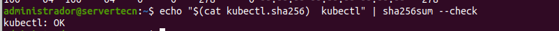
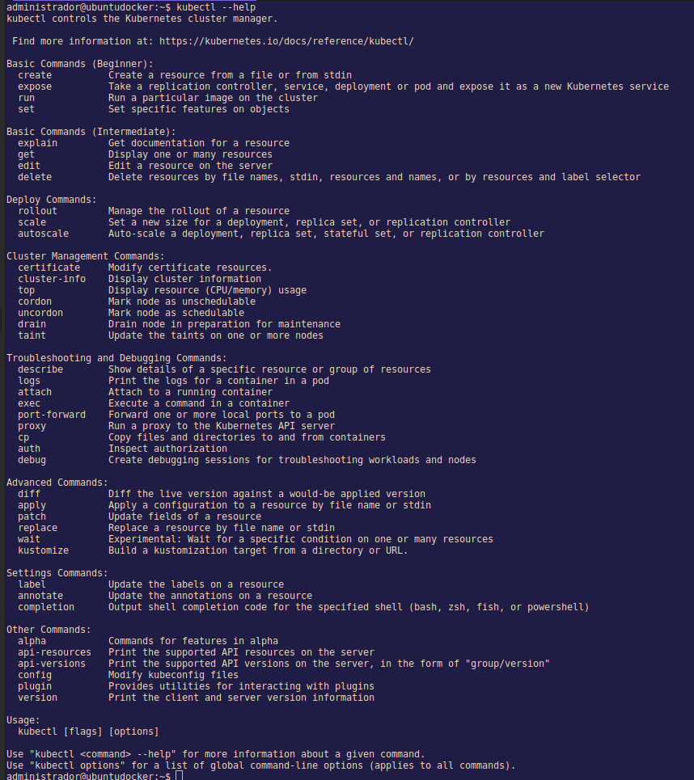
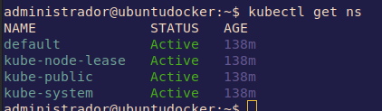
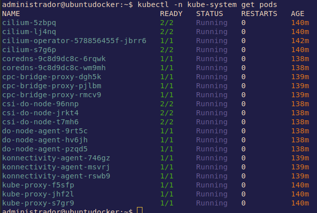
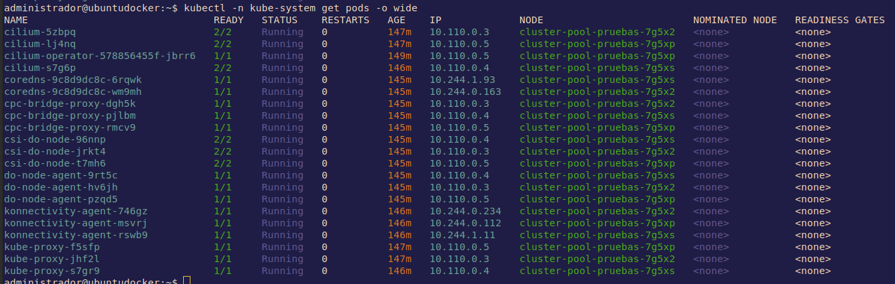
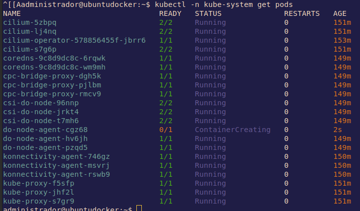
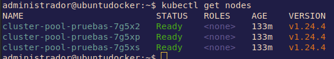

# Instalación kubectl

**Índice**
- [Instalación kubectl](#instalación-kubectl)
  - [Ayuda de kubeclt](#ayuda-de-kubeclt)
  - [Resultados de kubectl con colores: kubecolors](#resultados-de-kubectl-con-colores-kubecolors)

---

*Documentación oficial: https://kubernetes.io/docs/tasks/tools/install-kubectl-linux/*

Lo primero que debemos hacer para instalar kubectl es descargamos los paquetes.
```shell
curl -LO "https://dl.k8s.io/release/$(curl -L -s https://dl.k8s.io/release/stable.txt)/bin/linux/amd64/kubectl"
```
Descargamos validador kubectl checksum:
```shell
curl -LO "https://dl.k8s.io/$(curl -L -s https://dl.k8s.io/release/stable.txt)/bin/linux/amd64/kubectl.sha256"
```
Comprobamos
```shell
echo "$(cat kubectl.sha256)  kubectl" | sha256sum --check
```


Ahora ya podemos instalar
```shell
sudo install -o root -g root -m 0755 kubectl /usr/local/bin/kubectl
```
Para asegurarnos de que tenemos una versión actualizada.
```shell
kubectl version --client=true --output=yaml
```
Ponemos `--cliente=true` porque si no se intentaría conectar a un clúster kubernetes y trataría de descargar la versión kubernetes del clúster. Para un formato más legible controlamos la salida con `--output=yaml|json]`

## Ayuda de kubeclt

Podemos encontrar muy buena [documentación oficial](https://kubernetes.io/docs/reference/generated/kubectl/kubectl-commands), pero también se puede ver la ayuda del cliente con 
```shell
kubectl --help
```


> *Trascripción traducida de la ayuda de kubectl*
```shell
kubectl controla el gestor de clústeres de Kubernetes.

Encontrará más información en: https://kubernetes.io/docs/reference/kubectl/

Comandos básicos (principiante):
  create          Crear un recurso desde un archivo o desde stdin
  expose          Tomar un controlador de replicación, servicio, despliegue o pod y exponerlo como un nuevo servicio Kubernetes
  run             Ejecutar una imagen particular en el cluster
  set             Establecer características específicas en los objetos

Comandos básicos (Intermedio):
  explain         Obtener la documentación de un recurso
  get             Mostrar uno o varios recursos
  edit            Editar un recurso en el servidor
  delete          Eliminar recursos por nombres de archivo, stdin, recursos y nombres, o por recursos y selector de etiqueta

Comandos de despliegue:
  rollout         Gestionar el despliegue de un recurso
  scale           Establecer un nuevo tamaño para un despliegue, conjunto de réplicas o controlador de replicación
  autoscale       Escala automáticamente un despliegue, un conjunto de réplicas, un conjunto con estado o un controlador de replicación

Comandos de gestión del clúster:
  certificate     Modificar los recursos del certificado.
  cluster-info    Mostrar información del cluster
  top             Mostrar el uso de recursos (CPU/memoria)
  cordon          Marcar un nodo como no programable
  uncordon        Marcar el nodo como programable
  drain           Drenar el nodo en preparación para el mantenimiento
  taint           Actualizar los taints de uno o más nodos

Comandos de solución de problemas y depuración:
  describe        Mostrar los detalles de un recurso específico o de un grupo de recursos
  logs            Imprimir los registros de un contenedor en un pod
  attach          Adjuntar a un contenedor en ejecución
  exec            Ejecutar un comando en un contenedor
  port-forward    Reenviar uno o más puertos locales a un pod
  proxy           Ejecutar un proxy al servidor de la API de Kubernetes
  cp              Copiar archivos y directorios hacia y desde los contenedores
  auth            Inspeccionar la autorización
  debug           Crear sesiones de depuración para la resolución de problemas de cargas de trabajo y nodos

Comandos avanzados:
  diff            Comparar una versión en vivo contra una versión aplicada
  apply           Aplicar una configuración a un recurso por nombre de archivo o stdin
  patch           Actualizar los campos de un recurso
  replace         Reemplazar un recurso por nombre de archivo o stdin
  wait            Experimental: Esperar una condición específica en uno o varios recursos
  kustomize       Construir un objetivo de kustomize a partir de un directorio o una URL.

Settings Commands:
  label           Actualizar las etiquetas de un recurso
  annotate        Actualiza las anotaciones de un recurso
  completion      Imprimir el código de finalización del shell para el shell especificado (bash, zsh, fish o powershell)

Otros Comandos:
  alpha           Comandos para funciones en alpha
  api-resources   Imprime los recursos de la API soportados en el servidor
  api-versions    Imprime las versiones de la API admitidas en el servidor, en forma de "grupo/versión"
  config          Modifica los archivos kubeconfig
  plugin          Proporciona utilidades para interactuar con los plugins
  version         Imprime la información de la versión del cliente y del servidor

Uso:
  kubectl [flags] [options]

Utilice "kubectl <command> --help" para obtener más información sobre un determinado comando.
Utilice "kubectl options" para obtener una lista de opciones globales de la línea de comandos (se aplica a todos los comandos).
```

Una herramienta gráfica para kubectl es *[lens](https://k8slens.dev/)*., Muestra los contenedores de una manera clara y también tiene gráficas (memoria, CPU, etc).

Para mostrar los contextos que están en el fichero kubeconfig o el archivo de configuración de kubectl
```shell
kubectl config get-contexts
```

Para mostrar los namespaces:
```shell
kubectl get ns
```
Con el clúster recien creado aparecerán los namespaces por defecto que vienen con cualquier clúster.



Para ver los pods que están corriendo
```shell
kubectl -n kube-system get pods
```


`kube-system` es un namespace que utiliza kubernetes para correr los pods de sistema.

Tomando un ejemplo, `do-node-agent-9rt5c` es un agente que corre DigitalOcean en sus nodos para hacer algún tipo de recolección de datos o monitoreo. El final alfanumérico es porque ha sido generado por el template de pods *deployment*, todos los pods tendrá ese hash en el nombre.

La segunda columna indica el número de pods activos y los que existen. El estado, está claro, después están las columnas de los reinicios efectuados y la de el tiempo que lleva arrancado.

Con la opción `-o wide` mostrará un poco más de información.



Vamos a probar lo que dicen de kubernetes de que si se borra un pod se creará uno nuevo. 
```shell
kubectl -n kube-system delete pod do-node-agent-9rt5c
```
Inmediatamente muestro los pods y se puede ver como lo está creando de nuevo.


El pod es nuevo, tiene otro hash. Así que esto asegura que siempre estén el mismo número de pods.

## Resultados de kubectl con colores: kubecolors
Para verlo con colores se puede instalar el plugin de kubectl que se llama *[kubecolors](https://github.com/hidetatz/kubecolor)*

*En ubuntu:*
```shell
wget  http://archive.ubuntu.com/ubuntu/pool/universe/k/kubecolor/kubecolor_0.0.20-1_amd64.deb
```
```shell
sudo dpkg -i kubecolor_0.0.20-1_amd64.deb
```
```shell
sudo apt update && sudo apt install kubecolor -y

```
```shell
kubecolor --context=[tu_contexto] get pods -o json
```
```shell
kubecolor --context=do-ams3-k8s-1-24-4-do-0-ams3-..... get pods -o json
```
```shell
alias kubectl="kubecolor"
```


---

[01 Instalación kubctl](01-kubectl.md) --> [02 Clústers](02-clusters.md) --> [03 manifiestos](03-manifiestos.md) --> [04 Cheatsheet kubernetes](04-cheatsheet.md) --> [05 Helm: Control de despliegues en Kubernetes](05-helm.md) --> [K9s: Otro estilo de CLI para k8s](06-k9s.md)