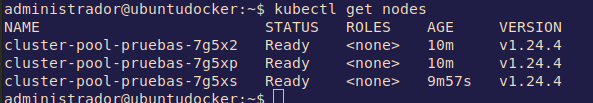

# Clústers 
 
 **Índice**

 - [Clústers en local](#clústers-en-local)
    - [kind](#kind)
    - [minikube](#minikube)
    - [MicroK8s](#microk8s)
      - [Instalación MicroK8s](#instalación-microk8s)
      - [Unirse al grupo](#unirse-al-grupo)
      - [Comprobar estado](#comprobar-estado)
      - [Acceso a Kubernetes](#acceso-a-kubernetes)
      - [Desplegar una aplicación](#desplegar-una-aplicación)
      - [Utilizar complementos](#utilizar-complementos)
      - [Iniciando y deteniendo MicroK8s](#iniciando-y-deteniendo-microk8s)
  - [Clúster remoto](#clúster-remoto)
    - [Digital Ocean](#digital-ocean)
      - [Resumen conexión de cluster Digital Ocean](#resumen-conexión-de-cluster-digital-ocean)


## Clústers en local

### kind

En **Linux**, podemos instalar [kind](https://kind.sigs.k8s.io/)


[Guía de instalación de Kind](https://kind.sigs.k8s.io/docs/user/quick-start)

En Linux tan solo hay que usar los siguientes comandos:

```shell
curl -Lo ./kind https://kind.sigs.k8s.io/dl/v0.16.0/kind-linux-amd64
chmod +x ./kind
sudo mv ./kind /usr/local/bin/kind
```

Una vez instalado, la creación de un clúster es tan sencillo como este comando:

```shell
kind create cluster
```

Para listar los clústeres:

```shell
kind get clusters
```

Para eliminarlo:

```shell
kind delete cluster
```

En este punto puede interesar crear un cluster con varios nodos y con un controlador de ingress con nginx. Este script lo hará todo por ti: [config_kind_with_ingress.sh](files/config_kind_with_ingress.sh)

Se le debe dar los permisos adecuados al script.

```shell
chmod +x config_kind_with_ingress.sh
```

### minikube
También podemos instalar minikube https://minikube.sigs.k8s.io/docs/ que instala todos los componentes de kubernetes en una MV y además tiene una serie de plugins para darle funcionalidades con una serie de paquetes precinfigurados.


### MicroK8s

MicroK8s instalará un Kubernetes mínimo y ligero que puede ejecutar y utilizar en prácticamente cualquier máquina.

[*Instalación microk8s*](https://microk8s.io/docs/getting-started)
#### Instalación MicroK8s
 Se puede instalar con un snap:
```shell
sudo snap install microk8s --classic --channel=1.25
```

#### Unirse al grupo

MicroK8s crea un grupo para permitir el uso sin problemas de los comandos que requieren privilegios de administrador. Para añadir su usuario actual al grupo y obtener acceso al directorio de caché .kube, ejecute los siguientes dos comandos:
```shell
sudo usermod -a -G microk8s $USER
```
```shell
sudo chown -f -R $USER ~/.kube
```
También tendrá que volver a entrar en la sesión para que la actualización del grupo se lleve a cabo:
```shell
su - $USER
```
Y se comprueba examinando los grupos de pertenencia del usuario:
```shell
id -nG
```

#### Comprobar estado

MicroK8s tiene un comando incorporado para mostrar su estado. Durante la instalación puede utilizar el indicador --wait-ready para esperar a que los servicios de Kubernetes se inicialicen:
```shell
microk8s status --wait-ready
```

#### Acceso a Kubernetes

MicroK8s incluye su propia versión de kubectl para acceder a Kubernetes. Utilícelo para ejecutar comandos para monitorear y controlar su Kubernetes. Por ejemplo, para ver su nodo:
```shell
microk8s kubectl get nodes
```
...o para ver los servicios en ejecución:
```shell
microk8s kubectl get services
```
MicroK8s utiliza un comando kubectl con espacio de nombre para evitar conflictos con cualquier instalación existente de kubectl. Si usted no tiene una instalación existente, es más fácil añadir un alias (añadir a ~/.bash_aliases) como este:
```shell
alias kubectl='microk8s kubectl'
```
#### Desplegar una aplicación

Por supuesto, Kubernetes está pensado para desplegar aplicaciones y servicios. Puedes usar el comando kubectl para hacerlo como con cualquier Kuberenetes. Prueba a instalar una app de demostración:
```shell
microk8s kubectl create deployment nginx --image=nginx
```
Puede tardar uno o dos minutos en instalarse, pero puedes comprobar el estado:
```shell
microk8s kubectl get pods
```
#### Utilizar complementos

MicroK8s utiliza el mínimo de componentes para un Kubernetes puro y ligero. ¡Sin embargo, hay un montón de características adicionales disponibles con unas pocas pulsaciones de teclas utilizando "add-ons" - componentes pre-empaquetados que proporcionarán capacidades adicionales para su Kubernetes, desde la simple gestión de DNS hasta el aprendizaje automático con Kubeflow!

Para empezar se recomienda añadir la gestión de DNS para facilitar la comunicación entre servicios. Para las aplicaciones que necesitan almacenamiento, el complemento "storage" proporciona espacio de directorio en el host. Esto es fácil de configurar:
```shell
microk8s enable dns storage
```
[Lista completa de complementos](https://microk8s.io/docs/addons#heading--list)

#### Iniciando y deteniendo MicroK8s

MicroK8s continuará funcionando hasta que usted decida detenerlo. Puede detener e iniciar MicroK8s con estos simples comandos:
```shell
microk8s stop
```
... detendrá MicroK8s y sus servicios. Puede iniciar de nuevo en cualquier momento ejecutando
```shell
microk8s start
```
Tenga en cuenta que **si deja MicroK8s funcionando, se reiniciará automáticamente después de un reinicio.** Si no quiere que esto ocurra, simplemente recuerde ejecutar microk8s stop antes de apagar.

## Clúster remoto

### Digital Ocean
En esta guía utilizaré [DigitalOcean](https://m.do.co/c/98c9ca613f37), con 3 nodos kubernetes de los baratitos.


Para conectar kubectl con el cluster de kubernetes se debe desarcargar el fichero *kubeconfig* que es donde están declarados los contextos de kubernetes. Es una combinación de la url del servidor con las credenciales de lo que se haya instalado. 


*Con minikube no tendríamos que hacer nada porque se configura automáticamente.*

Se exporta en una variable de entorno
```shell
kubectl --kubeconfig=/<pathtodirectory>/k8s-1-24-4-do-0...........yaml get nodes
```
Y podremos comprobar los nodos con
```shell
kubectl get nodes
```



#### Resumen conexión de cluster Digital Ocean
Para que tenga el color y todo
```shell
export KUBECONFIG=~/Downloads/k8s-1-20.... get nodes
```
Comprobamos
```shell
kubectl get nodes
```
Vemos el contexto
```shell
kubectl config get-contexts
```
Añadimos el contexto en el plugin del color
```shell
kubecolor --context=do-ams3-k8s-1-24-4-do-...... get pods -o json
```
Nos aseguramos del alias y volvemos a comprobar
```shell
alias kubectl="kubecolor"
```
```shell
kubectl get nodes
```

---

Puedes seguir con la guía [03 manifiestos](guias/03-manifiestos.md).

Todas las guías:

- [01 Instalación kubctl](guias/01-kubectl.md) 
- [02 Clústers](guias/02-clusters.md) 
- [03 manifiestos](guias/03-manifiestos.md) 
- [04 Cheatsheet kubernetes](guias/04-cheatsheet.md) 
- [05 Helm: Control de despliegues en Kubernetes](guias/05-helm.md) 
- [06 K9s: Otro estilo de CLI para k8s](guias/06-k9s.md)