# Ejemplos de manifiestos
**Índice**
- [Ejemplos de manifiestos](#ejemplos-de-manifiestos)
  - [Manifiesto de POD](#manifiesto-de-pod)
  - [Otro Manifiesto de POD](#otro-manifiesto-de-pod)
  - [Manifiesto de Deployment](#manifiesto-de-deployment)
  - [Manifiesto de daemonset](#manifiesto-de-daemonset)
  - [Manifiesto de statefulset](#manifiesto-de-statefulset)
  - [Manifiesto cluster ip](#manifiesto-cluster-ip)
    - [Pod Networking](#pod-networking)
    - [Kube-proxy](#kube-proxy)
  - [Manifiesto nodeport](#manifiesto-nodeport)
  - [Manifiesto load balancer](#manifiesto-load-balancer)
  - [Manifiesto versiones e ingress](#manifiesto-versiones-e-ingress)
  - [Manifiesto configmap](#manifiesto-configmap)
  - [Manifiesto secret](#manifiesto-secret)
  - [Manifiesto kustomization](#manifiesto-kustomization)
  - [stern](#stern)

## Manifiesto de POD
Ahora utilizaremos un manifiesto de un pod del [pelado Nerd](https://github.com/pablokbs/peladonerd/tree/master/kubernetes/35) llamado [01-pod.ymal](../file/yaml-del-pelado/01-pod.yaml)

```yaml
apiVersion: v1
kind: Pod
metadata:
  name: nginx
spec:
  containers:
  - name: nginx
    image: nginx:alpine

```
Tendremos:
- La *versión de la API* de este recurso de kubernetes. Se debe extraer de la documentación de kubernetes.
- El *recurso*
- En *metadata* podemos poner algunos valores que identifiquen nuestro pod. Siempre tiene que tener un `name`.
- En las *especificaciones* declaramos los contenedores que corren. En este caso ponemos el nombre y la imagén en concreto.

Para aplicar este manifiesto
```shell
kubectl apply -f 01-pod.yaml
```
Si no especificamos un namespaces lo aplica en el que tenemos por defecto. Podremos mostrar que ya está corriendo.


Ahora, para correr un comando dentro del pod usaremos este comando
```shell
kubectl exec -it nginx -- sh
```
Con la misma opción de docker, `-it` nos permite que sea interactivo.


Para salir es con `CTRL+d`.

Borrar un pod
```shell
kubectl delete pod nginx
```
Como no se creo la orden para mantener siempre un pod, el pod desapareció. 

## Otro Manifiesto de POD

Otro manifiesto de un pod del [pelado Nerd](https://github.com/pablokbs/peladonerd/tree/master/kubernetes/35) llamado [02-pod.ymal](../file/yaml-del-pelado/02-pod.yaml) es lo mismo pero con más opciones.

```yaml
apiVersion: v1
kind: Pod
metadata:
  name: nginx
spec:
  containers:
  - name: nginx
    image: nginx:alpine
    env:
    - name: MI_VARIABLE
      value: "pelado"
    - name: MI_OTRA_VARIABLE
      value: "pelade"
    - name: DD_AGENT_HOST
      valueFrom:
        fieldRef:
          fieldPath: status.hostIP
    resources:
      requests:
        memory: "64Mi"
        cpu: "200m" # son milicores, cada core tiene 1000 milicores
      limits:
        memory: "128Mi"
        cpu: "500m" 
    readinessProbe:
      httpGet:
        path: /
        port: 80
      initialDelaySeconds: 5
      periodSeconds: 10
    livenessProbe:
      tcpSocket:
        port: 80
      initialDelaySeconds: 15
      periodSeconds: 20
    ports:
    - containerPort: 80
```

En este tenemos más especificaciones:
- *Variables de entorno* como clave-valor. Con `DD_AGENT_HOST` podemos pasar el valor de otro sitio gracias a *[Downward](https://kubernetes.io/docs/concepts/workloads/pods/downward-api/)* de kubernetes, que son valores que se pueden heredar, en este caso indicamos la ip del host donde va a correr este pod: `status.hostIP`.
- Se indican los recursos que se garantizan por contenedor con `requests` y los limites con `limits`. Los límites provocan que el kernel de Linux haga CPU Throttling, es decir, ahorcará el proceso hasta que use la velocidad límite y si no lo matará y esto hará que se cree otro pod.
- *ReadinessProbe* es una forma de explicarle a kubernetes de que el pod está preparado para recibir tráfico. Kubernetes comprueba la raíz esperando un status code 200.
- *livenessProbe*  es una forma de explicarle a kubernetes de que el pod está vivo y no quieres que lo mate. Kubernetes comprueba el socker del puerto 80 de que está vivo.
- Por último tenemos el *puerto* que queremos poner.

Vamos a correrlo
```shell
kubectl apply -f pelado_nerd_pruebas/kubernetes/35/02-pod.yaml
```
Podemos ver el estado del pod con
```shell
 kubectl get pod nginx
```
Y además veremos el yaml si le añadimos la opción `-o yaml` con todas las variables y parámetros por defecto que le ha añadido kubernetes.
```shell
 kubectl get pod nginx -o yaml
```
## Manifiesto de Deployment
Pero para trabajar con kubernetes, no deberíamos levantar el recurso mínimo como son los pods, es mejor aprocechar la capacidad de orquestación de la herramienta y levantar deployment. Lo encontraremos en otro manifiesto de un deployment del [pelado Nerd](https://github.com/pablokbs/peladonerd/tree/master/kubernetes/35) llamado [04-deployment.yaml](../file/yaml-del-pelado/04-deployment.yaml).
```yaml
apiVersion: apps/v1
kind: Deployment
metadata:
  name: nginx-deployment
spec:
  selector:
    matchLabels:
      app: nginx
  replicas: 2
  template:
    metadata:
      labels:
        app: nginx
    spec:
      containers:
      - name: nginx
        image: nginx:alpine
        env:
        - name: MI_VARIABLE
          value: "pelado"
        - name: MI_OTRA_VARIABLE
          value: "pelade"
        - name: DD_AGENT_HOST
          valueFrom:
            fieldRef:
              fieldPath: status.hostIP
        resources:
          requests:
            memory: "64Mi"
            cpu: "200m"
          limits:
            memory: "128Mi"
            cpu: "500m"
        readinessProbe:
          httpGet:
            path: /
            port: 80
          initialDelaySeconds: 5
          periodSeconds: 10
        livenessProbe:
          tcpSocket:
            port: 80
          initialDelaySeconds: 15
          periodSeconds: 20
        ports:
        - containerPort: 80
```

Es muy parecido al yaml de los pods pero especificando como una plantilla de pods en el `spec` dentro del `spec`.

Las réplicas son el número de pods que queremos dentro del deployment.

Aplicamos el manifiesto
```shell
kubectl apply -f 04-deployment.yaml
```
Y veremos como ha desplegado las 2 réplicas que se indica en el manifiesto.


Ahora sí que si borramos uno de los pods, como en el manifiesto indicamos 2 réplicas, kubernetes lo creará de nuevo.

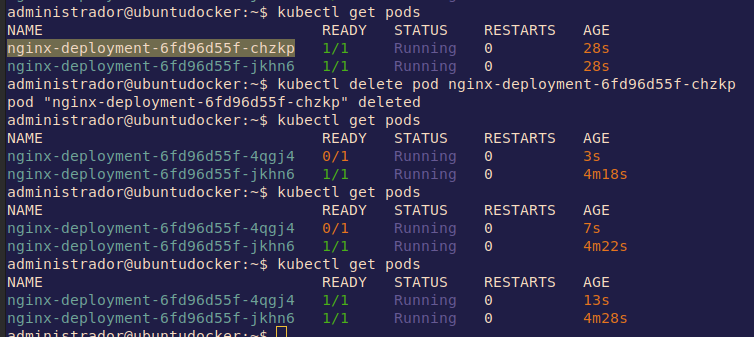

Para borrar el deployment utilizaremos el mismo yaml con el que lo corrimos.
```shell
kubectl delete -f 04-deployment.yaml
```
## Manifiesto de daemonset
`daemonset` es otra forma de deployment un pod pero en este caso será un pod en cada uno de los nodos existente. No indicas las réplicas por eso. Sirve, por ejemplo, para despliegues de servicios de monitoreo. De nuevo, vamos a un manifiesto de un daemonset del [pelado Nerd](https://github.com/pablokbs/peladonerd/tree/master/kubernetes/35) llamado [03-daemonset.yaml](../file/yaml-del-pelado/03-daemonset.yaml).
```yaml
apiVersion: apps/v1
kind: DaemonSet
metadata:
  name: nginx-deployment
spec:
  selector:
    matchLabels:
      app: nginx
  template:
    metadata:
      labels:
        app: nginx
    spec:
      containers:
      - name: nginx
        image: nginx:alpine
        env:
        - name: MI_VARIABLE
          value: "pelado"
        - name: MI_OTRA_VARIABLE
          value: "pelade"
        - name: DD_AGENT_HOST
          valueFrom:
            fieldRef:
              fieldPath: status.hostIP
        resources:
          requests:
            memory: "64Mi"
            cpu: "200m"
          limits:
            memory: "128Mi"
            cpu: "500m"
        readinessProbe:
          httpGet:
            path: /
            port: 80
          initialDelaySeconds: 5
          periodSeconds: 10
        livenessProbe:
          tcpSocket:
            port: 80
          initialDelaySeconds: 15
          periodSeconds: 20
        ports:
        - containerPort: 80
```
Veremos como se han desplegado 3 pods, uno por nodo.


Borramos de nuevo con el fichero
```shell
kubectl delete -f pelado_nerd_pruebas/kubernetes/35/03-daemonset.yaml
```

## Manifiesto de statefulset
`statefulset` podemos crear pods con volumenes que estarán atados. Es la manera de que los datos sean persistentes, como en Docker. Sirve, por ejemplo, para las BBDD. El manifiesto de statefulset del [pelado Nerd](https://github.com/pablokbs/peladonerd/tree/master/kubernetes/35) llamado [05-statefulset.yaml](../file/yaml-del-pelado/05-statefulset.yaml).

```yaml
apiVersion: apps/v1
kind: StatefulSet
metadata:
  name: my-csi-app-set
spec:
  selector:
    matchLabels:
      app: mypod
  serviceName: "my-frontend"
  replicas: 1
  template:
    metadata:
      labels:
        app: mypod
    spec:
      containers:
      - name: my-frontend
        image: busybox
        args:
        - sleep
        - infinity
        volumeMounts:
        - mountPath: "/data"
          name: csi-pvc
  volumeClaimTemplates:
  - metadata:
      name: csi-pvc
    spec:
      accessModes:
      - ReadWriteOnce
      resources:
        requests:
          storage: 5Gi
      storageClassName: do-block-storage
```
Dentro de `volumeClaimTemplates` se le dan las especificaciones al volumen y, en concreto, `storageClassName: do-block-storage` es un driver que permite construir un volumen digital en DigitalOcean. Cuando se aplique este manifiesto se creará automáticamente el volumen de 5 Gb y se conectará al clúster de kubernetes.
```shell
kubectl apply -f kubernetes/35/05-statefulset.yaml 
```
Ahora vamos a ver los detalles de un pod
```shell
kubectl describe pod my-csi-app-set-0
```


En la parte superior salen todas las descripciones habituales. Más abajo aparecen los eventos del pod.


En los eventos se puede ver como intentó crear un pvc (PersistentVolumeClaims). Es un pedido desde kubernetes al proveedor. Se pueden ver con el siguiente comando.
```shell
kubectl get pvc
```


Podemos pedir el `describe` del pvc
```shell
kubectl describe pvc csi-pvc-my-csi-app-set-0
```
Vewremos sus descripción y los eventos.


Si vamos al dashboard de DigitalOCean podremos ver en volumenes el recien creado.


Ahora si miramos los statefilsets y borramos por su nombre, el volumen quedará.
```shell
 kubectl get statefulsets
```
```shell
kubectl delete sts [nombre-del-statefulsets]
```


Tendremos que borrar expresamente el volumen si nos queremos deshacer de él.

```shell
kubectl delete pvc csi-pvc-my-csi-app-set-0
```

## Manifiesto cluster ip

Antes de aplicar el manifiesto, unas explicaciones aclaratorias.
### Pod Networking


**calico** es un agente que corre en cada nodo que crea rutas IPs para enrutar entre cada uno de los nodos.

**etcd** es la BBDD de kubernetes donde se guardan los estados.

### Kube-proxy


Los servicios en Kubernetes son una forma de poder contactar entre aaplicaciones, ya sea desde dentro del clúster entre pods o desde fuera. Hay 3 tipos:
- **Clúster IP** - Una especie de load balancer entre pods 
- **Node Port** - crea un puerto en cada nodo que crea el servicio entre los pods que se configuren. Lo encontrarán `kube-proxy`.
- **Load Balancer** - Crea un balancedor de carga en el proveedor de cloud para redireccionar el tráfico a los pods.

Ahora vamos a aplicar el fichero yaml [06-randompod.yaml](../file/yaml-del-pelado/06-randompod.yaml) que lo que hará es levantar un ubuntu sleep. Podremos entrar a este pod para acceder al resto. 
```yaml
apiVersion: v1
kind: Pod
metadata:
  name: ubuntu
spec:
  containers:
  - name: ubuntu
    image: ubuntu
    args:
    - sleep
    - infinity
```

```shell
kubectl apply -f kubernetes/35/06-randompod.yaml
```

El resto será el fichero yaml [07-hello-deployment-svc-clusterIP.yaml](../file/yaml-del-pelado/07-hello-deployment-svc-clusterIP.yaml)
```yaml
apiVersion: apps/v1
kind: Deployment
metadata:
  name: hello
spec:
  replicas: 3
  selector:
    matchLabels:
      role: hello
  template:
    metadata:
      labels:
        role: hello
    spec:
      containers:
      - name: hello
        image: gcr.io/google-samples/hello-app:1.0
        ports:
        - containerPort: 8080

---
apiVersion: v1
kind: Service
metadata:
  name: hello
spec:
  ports:
  - port: 8080
    targetPort: 8080
  selector:
    role: hello
```
Para verlo todo solicitaremos que lo muestre con el siguiente comando
```shell
kubectl get all
```


Podemos ver las IPs de los clústers pero no las de los pods. Pero podemos pedir un describe del servicio para más detalles.
```shell
kubectl describe svc hello
```


Los `Endpoints` son las IPs de cada uno de los pods.

Tamnbién se pueden ver con un get pods detallado.
```shell
kubectl get pods -o wide
```


Si matamos un pod, automáticamente se volverá a crear y será balanceado por el servicio.

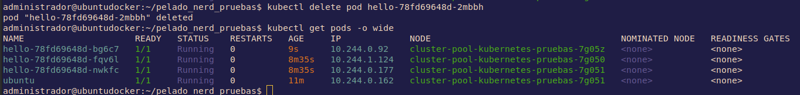

Para poder hacer ping tengo que instalar un ubuntu con iputils: https://hub.docker.com/r/mmoy/ubuntu-netutils/

Lo cambio en el manifiesto quedando así
```yaml
apiVersion: v1
kind: Pod
metadata:
  name: ubuntu
spec:
  containers:
  - name: ubuntu
    image: mmoy/ubuntu-netutils
    args:
    - sleep
    - infinity
```

Ahora ya puedo hacer las comprobaciones desde el pod ubuntu con ping y curl para ver como balancea la carga.


## Manifiesto nodeport

Borramos el anterior `hello` y vamos a aplicar el manifiesto [08-hello-deployment-svc-nodePort.yaml](../file/yaml-del-pelado/08-hello-deployment-svc-nodePort.yaml) del Pelado.

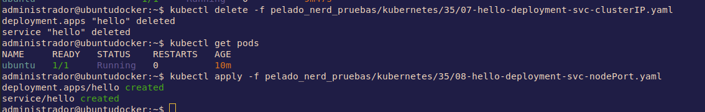

El manifiesto es el siguiente
```yaml
apiVersion: apps/v1
kind: Deployment
metadata:
  name: hello
spec:
  replicas: 3
  selector:
    matchLabels:
      role: hello
  template:
    metadata:
      labels:
        role: hello
    spec:
      containers:
      - name: hello
        image: gcr.io/google-samples/hello-app:1.0
        ports:
        - containerPort: 8080

---
apiVersion: v1
kind: Service
metadata:
  name: hello
spec:
  type: NodePort
  ports:
  - port: 8080
    targetPort: 8080
    nodePort: 30000
  selector:
    role: hello

```

En el anterior manifiesto no se especifico el tipo porque por defecto es de cluster ip. En cambio, en este se puede ver `type: NodePort`. Le podemos especificar el puerto de cada nodo para llegar al servicio: `nodePort: 30000`.


Si mostramos los nodos detalladamente podremos ver las IPs de los nodos, si hacemos curl a la IP con el puerto especificado podremos ver el balanceo de carga.

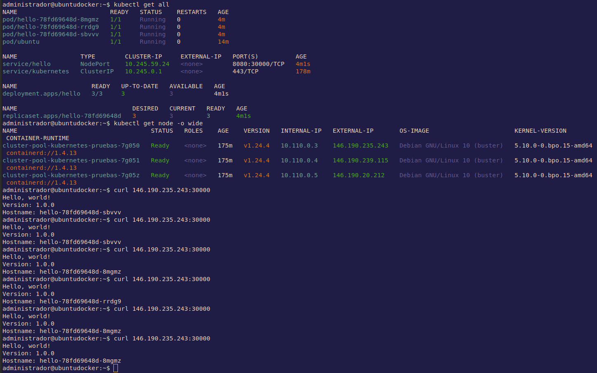

Hace lo mismo que el cluster ip pero desde fuera, exponiendo el puerto al mundo.

## Manifiesto load balancer

En esta ocasión utilizaremos el documento [09-hello-deployment-svc-loadBalancer.yaml](../file/yaml-del-pelado/09-hello-deployment-svc-loadBalancer.yaml) del querido Pelado.

Es el siguiente
```yaml
apiVersion: apps/v1
kind: Deployment
metadata:
  name: hello
spec:
  replicas: 3
  selector:
    matchLabels:
      role: hello
  template:
    metadata:
      labels:
        role: hello
    spec:
      containers:
      - name: hello
        image: gcr.io/google-samples/hello-app:1.0
        ports:
        - containerPort: 8080

---
apiVersion: v1
kind: Service
metadata:
  name: hello
spec:
  type: LoadBalancer
  ports:
  - port: 8080
    targetPort: 8080
  selector:
    role: hello
```
En este enseguida hemos visto que el tipo de servicio es `LoadBalancer`. 

Nos aseguramos que borramos el anterior nodeport y aplicamos este

En esta ocasión, el servicio está `<pending>` ya que lo tiene que desplegar DigitalOcean y suele tardar un ratito.


Es mejor hacer este tipo que nodeport, ya que nodeport está atado en cada nodo. En cambio, con loadbalancer siempre es la misma IP.

Si vamos al dashboard de DigitalOcean podremos ver el balanceador.

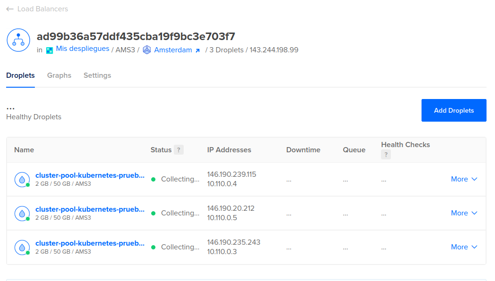

Una vez desplegado ya tendremos nuestra ip y podremos comprobarla como balancea con curl.


## Manifiesto versiones e ingress

Utilizaremos el fichero yaml [10-hello-v1-v2-deployment-svc.yaml](../file/yaml-del-pelado/10-hello-v1-v2-deployment-svc.yaml) del Pelado.

```yaml
apiVersion: apps/v1
kind: Deployment
metadata:
  name: hello-v1
spec:
  replicas: 3
  selector:
    matchLabels:
      role: hello-v1
  template:
    metadata:
      labels:
        role: hello-v1
    spec:
      containers:
      - name: hello-v1
        image: gcr.io/google-samples/hello-app:1.0
        ports:
        - containerPort: 8080

---

apiVersion: apps/v1
kind: Deployment
metadata:
  name: hello-v2
spec:
  replicas: 3
  selector:
    matchLabels:
      role: hello-v2
  template:
    metadata:
      labels:
        role: hello-v2
    spec:
      containers:
      - name: hello-v2
        image: gcr.io/google-samples/hello-app:2.0
        ports:
        - containerPort: 8080

---
apiVersion: v1
kind: Service
metadata:
  name: hello-v1
spec:
  ports:
  - port: 8080
    targetPort: 8080
  selector:
    role: hello-v1

---
apiVersion: v1
kind: Service
metadata:
  name: hello-v2
spec:
  ports:
  - port: 8080
    targetPort: 8080
  selector:
    role: hello-v2

```

Tendremos 2 versiones de la aplicación y un servicio por cada uno. Se puede ver cuando aplicamos.


Con un `get all` podemos ver que tenemos 6 pods, 3 por cada versión, y un servicio por versión.


`Ingress` es un tipo de recurso que nos permite crear accesos a nuestro servicio basados en el path. Kubernetes hace un deploy de un controlador nginx que va a leer las configuraciones de Ingress y se va a autoconfigurar para enviar el tráfico a donde tenga que hacerlo.

No todos los proveedores de cloud tienen instalado nginx, con lo que en algunos hay que instalarlo. Una opción para instalarlo es utilizar la herramienta [helm](https://helm.sh/) 

En DigitalOcean, en la pestaña de marketplace del dashboard del clúster podremos ver aplicaciones a instalar, entre la que está nginx.

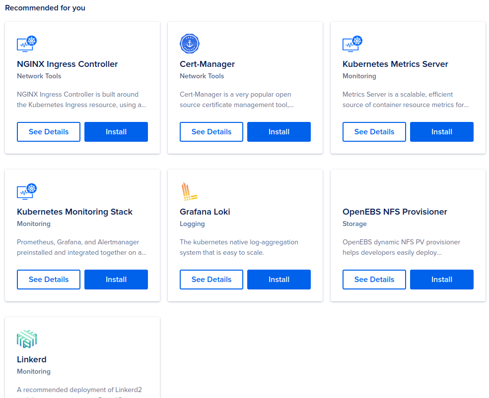

Para instalarlo simplemente tenemos que darle al botón. 


Tardará un rato...

El controlador de nginx ingress creará un namespace, podremos verlo con `get ns` y si mostramos los pods filtrando por este namespaces veremos los que corren bajo nginx.

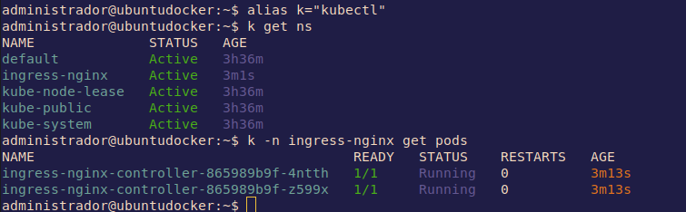

Ingress tiene muchas posibilidades, es importante darle un vistazo a su documentación: https://kubernetes.io/docs/concepts/services-networking/ingress/


Ahora aplicamos el fichero yaml [11-hello-ingress.yaml](../file/yaml-del-pelado/11-hello-ingress.yaml) de Mr. Pelado.

```yaml
apiVersion: networking.k8s.io/v1
kind: Ingress
metadata:
  name: hello-app
spec:
  rules:
  - http:
      paths:
      - path: /v1
        pathType: Prefix
        backend:
          service:
            name: hello-v1
            port:
              number: 8080
      - path: /v2
        pathType: Prefix
        backend:
          service:
            name: hello-v2
            port:
              number: 8080
```
Podemos mostrar los recursos ingress con el siguiente comando
```shell
kubectl get ing
```
Para hacernos una idea podemos ver este diagrama de ejemplo de la documentación de Digital Ocean, buenísimos documentando.


Se puede ver que también se crea un load balancer que es el que recibirá todo el tráfico externo. 

Crear este balanceador con ingress es lo más común y lo más ágil. Hay otras alternativas como [Traefik](https://traefik.io/)


## Manifiesto configmap

`ConfigMap`es un fichero que lo hostear en kubernetes y se puede acceder desde los pods. Sirve para poder introduccir variables, 

Utilizaremos el fichero yaml [12-configmap.yaml](../file/yaml-del-pelado/12-configmap.yaml) como el Pelado manda.
```yaml
apiVersion: v1
kind: ConfigMap
metadata:
  name: game-demo
data:
  # property-like keys; each key maps to a simple value
  player_initial_lives: "3"
  ui_properties_file_name: "user-interface.properties"
  #
  # file-like keys
  game.properties: |
    enemy.types=aliens,monsters
    player.maximum-lives=5
  user-interface.properties: |
    color.good=purple
    color.bad=yellow
    allow.textmode=true

```
Y también levantaremos un pod de nginx con el fichero yaml [13-pod-configmap.yaml](../file/yaml-del-pelado/13-pod-configmap.yaml)

```yaml
apiVersion: v1
kind: Pod
metadata:
  name: nginx
spec:
  containers:
    - name: nginx
      image: nginx:alpine
      env:
        # Define the environment variable
        - name: PLAYER_INITIAL_LIVES # Nombre de la variable
          valueFrom:
            configMapKeyRef:
              name: game-demo           # El confimap desde donde vienen los valores
              key: player_initial_lives # La key que vamos a usar
        - name: UI_PROPERTIES_FILE_NAME
          valueFrom:
            configMapKeyRef:
              name: game-demo
              key: ui_properties_file_name
      volumeMounts:
      - name: config
        mountPath: "/config"
        readOnly: true
  volumes:
    - name: config
      configMap:
        name: game-demo # el nombre del configmap que queremos montar
        items: # Un arreglo de keys del configmap para crear como archivos
        - key: "game.properties"
          path: "game.properties"
        - key: "user-interface.properties"
          path: "user-interface.properties"

```
En este archivo se puede ver como se define la variable de entorno `PLAYER_INITIAL_LIVES` pero el valor se lo asignaremos con el fichero `configmap` con la especificación `valueFrom`. En `configMapKeyRef` tendremos el `name` de la configmap de donde vienen los valores y la `key`que vamos a utilizar.

Además, se va a montar un volumen con `volumeMounts` donde se generarán archivos basados en el `configmap`, indicando el `name`, el path donde se ubicará con `mountPath` y le decimos que sea de solo lectura con `readOnly: true`, es decir, que desde el pod no lo podré modificar. Más abajo se define el volumen para poderlo crear y se indican los `items` para indicar los nombres de los ficheros (`key`) y su ubicación (`path`).

Primero aplicamos el configmap y luego el pod.

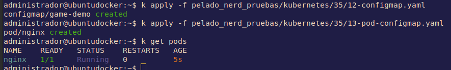

Si entramos en el pod ngnix y mostramos las variables de entorno encontraremos las que hemos definido con configmap.

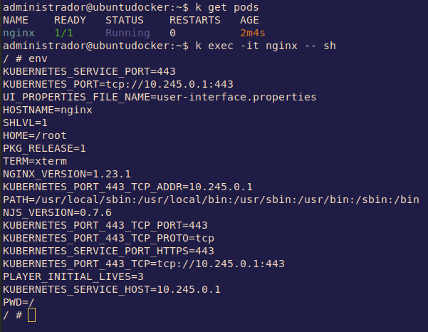

Y también tendremos los ficheros con los valores definidos en el configmap.

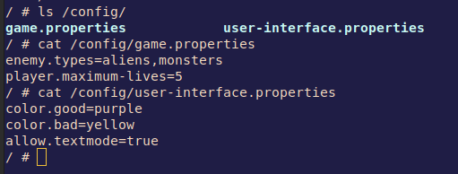

Esto nos servirá para guardar configuraciones de las aplicaciones que podremos personalizar para cada pod.

## Manifiesto secret

Los `secret` son muy parecidos a los configmap, la diferencia es que el contenido estaŕa codificado en base64. No es seguro, no es un cifrado es una codificación. A simple vista no se puede leer pero los pods si que pueden hacerlo.

Usaremos el fichero yaml bien peladito [14-secret.yaml](../file/yaml-del-pelado/14-secret.yaml).
```yaml
apiVersion: v1
kind: Secret
metadata:
  name: db-credentials
type: Opaque
data:
  username: YWRtaW4=
  password: c3VwM3JwYXNzdzByZAo=

# Esto se puede crear a mano:
# kubectl create secret generic db-credentials --from-literal=username=admin --from-literal=password=sup3rpassw0rd
# Docs: https://kubernetes.io/es/docs/concepts/configuration/secret/

```

Para codificar en base64
```shell
echo -n "admin" | base64
```
```shell
echo -n "sup3rpassw0rd" | base64
```
Y para descodificar
```shell
echo -n "YWRtaW4=" | base64 -d
```
```shell
echo -n "c3VwM3JwYXNzdzByZA==" | base64 -d
```

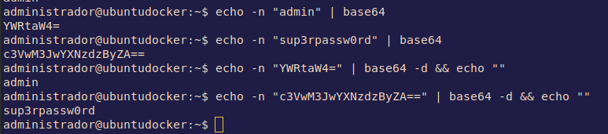


*Recomendación*: Revisar la documentación: https://kubernetes.io/es/docs/concepts/configuration/secret/

También se puede crear el `secret` a mano:
```shell
kubectl create secret generic db-credentials --from-literal=username=admin
```

Para probarlo utilizaremos otro pod nginx, también del Pelado Nerd, llamado [15-pod-secret.yaml](../file/yaml-del-pelado/15-pod-secret.yaml)

```yaml
apiVersion: v1
kind: Pod
metadata:
  name: nginx
spec:
  containers:
  - name: nginx
    image: nginx:alpine
    env:
    - name: MI_VARIABLE
      value: "pelado"
    - name: MYSQL_USER
      valueFrom:
        secretKeyRef:
          name: db-credentials
          key: username
    - name: MYSQL_PASSWORD
      valueFrom:
        secretKeyRef:
          name: db-credentials
          key: password
    ports:
    - containerPort: 80
```

En las variables `env` tendremos el usuario y el password de mysql con los `name` MYSQL_USER y MYSQL_PASSWORD que cogerán el valor con `secretKeyRef` de db-credentials, que es el nombre del secret del manifiesto anterior.

Así que aplicamos los manifiestos y comprobamos 

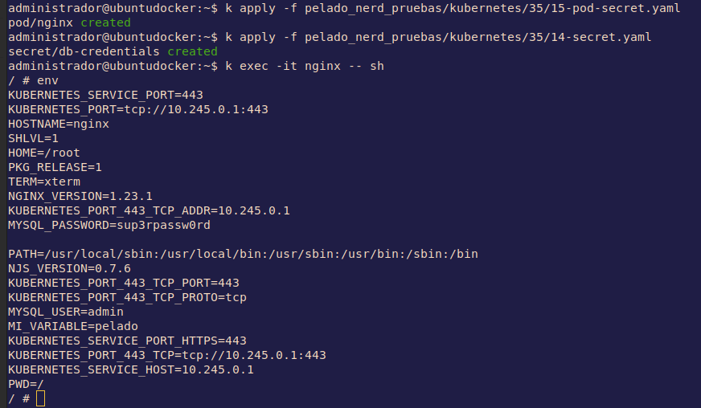

<span style="color:red;font-size:2em;font-weight:bold;">
Esta no es una buena práctica para gestionar secrets. 
</span>


[KubeSealed](https://github.com/bitnami-labs/sealed-secrets) es un controlador de kubernetes que cifra las credenciales utilizando un certificado.

## Manifiesto kustomization

`kustomization` es una forma de manejar manifiestos más fácilmente. Nos permite con un cliente embebido a kubectl generar manifiestos. 

Utilizaremos el fichero del Pelado Nerd [kustomization.yaml](../file/yaml-del-pelado/kustomization.yaml)

```yaml
apiVersion: kustomize.config.k8s.io/v1beta1
kind: Kustomization

commonLabels:
  app: ejemplo

resources:
- 15-pod-secret.yaml

secretGenerator:
- name: db-credentials
  literals:
  - username=admin
  - password=secr3tpassw0rd!

images:
- name: nginx
  newTag: latest

```
Con una especie de plugins podremos, por ejemplo: 
- Taguear todos los manifiestos. (`commonLabels`).
- Generar un secret (En el yaml no se siguen buenas prácticas para los secret) (`secretGenerator`).
- Cambiar una imagen (`images`)

Primero instalaremos los paquetes necesarios para que funcione.
```shell
sudo apt update && sudo snap install kustomize
```
Luego tendremos que construir el archivo con el comando, que leerá el archivo `kustomization.yaml` y hará lo que tenga que hacer.
```shell
kustomize build .
```
En concreto, creará el secreto basado en el literal del fichero yaml y creo el pod que se indico en `resource`. Además metió la label en la metadata y cambio la imagen por `nginx:latest`.


Podemos borrar el pod y volver a correr el mismo comando kustomize con una tubería.
```shell
kustomize build . | kubectl apply -f -

```
Se puede ver que ha cambiado el hash de los `name`

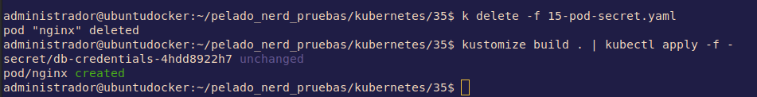

Si cambiamos algo del fichero yaml y volvemos a correr el comando kustomize, volverá a cambiar el hash. Guarda versiones.

## stern

`stern` es una utilidad súper simple que permite especificar tanto el id del pod como el id del contenedor como expresiones regulares. Cualquier coincidencia será seguida y la salida es multiplexada, prefijada con el id del pod y el id del contenedor, y codificada por colores para el consumo humano 

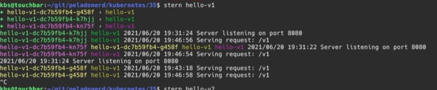

---

Puedes seguir con la guía [04 Cheatsheet kubernetes](04-cheatsheet.md).

Todas las guías:

- [01 Instalación kubctl](01-kubectl.md) 
- [02 Clústers](02-clusters.md) 
- [03 manifiestos](03-manifiestos.md) 
- [04 Cheatsheet kubernetes](04-cheatsheet.md) 
- [05 Helm: Control de despliegues en Kubernetes](05-helm.md) 
- [06 K9s: Otro estilo de CLI para k8s](06-k9s.md)