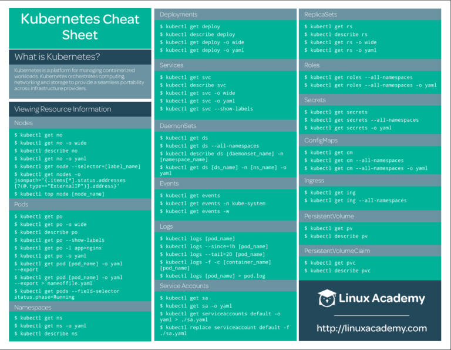

# Cheatsheet kubernetes

**Índice**
- [Cheatsheet kubernetes](#cheatsheet-kubernetes)
  - [Resumen en una imagen](#resumen-en-una-imagen)
  - [Visualizar información de los recursos](#visualizar-información-de-los-recursos)
    - [Nodes](#nodes)
    - [ods](#ods)
    - [Namespaces](#namespaces)
    - [Deployments](#deployments)
    - [Services](#services)
    - [DaemonSets](#daemonsets)
    - [Events](#events)
    - [Logs](#logs)
    - [Service Accounts](#service-accounts)
    - [ReplicaSets](#replicasets)
    - [Roles](#roles)
    - [Secrets](#secrets)
    - [ConfigMaps](#configmaps)
    - [Ingress](#ingress)
    - [PersistentVolume](#persistentvolume)
    - [PersistentVolumeClaim](#persistentvolumeclaim)
    - [StorageClass](#storageclass)
    - [MultipleResources](#multipleresources)
  - [Modificar atributos de los recursos](#modificar-atributos-de-los-recursos)
    - [Taint](#taint)
    - [Labels](#labels)
    - [Cordon/Uncordon](#cordonuncordon)
    - [Drain](#drain)
    - [Nodes/Pods](#nodespods)
    - [Deployments/Namespaces](#deploymentsnamespaces)
    - [Services](#services-1)
    - [DaemonSets](#daemonsets-1)
    - [ServiceAccounts](#serviceaccounts)
    - [Annotate](#annotate)
  - [Añadir recursos](#añadir-recursos)
    - [Crear Pod](#crear-pod)
    - [Crear un Service](#crear-un-service)
    - [Crear Deployment](#crear-deployment)
    - [Interactive Pod](#interactive-pod)
    - [Salida de YAMLto en un fichero](#salida-de-yamlto-en-un-fichero)
    - [Ayuda](#ayuda)
  - [Solicitaciones](#solicitaciones)
    - [Llamar a la API](#llamar-a-la-api)
    - [Información del Cluster](#información-del-cluster)


## Resumen en una imagen


[Descarga PNG](../img/kubernetes-cheat-sheet.png)

## Visualizar información de los recursos
### Nodes
```shell
kubectl get no
```
```shell
kubectl get no -o wide
```
```shell
kubectl describe no
```
```shell
kubectl get no -o yaml
```
```shell
kubectl get node –select or =[ label _name]
```
```shell
kubectl get nodes -o jsonpath='{.items[*].status.addresses[?(@.type==”ExternalIP”)].address}’
```
```shell
kubectl top node [node_name]
```
### ods
```shell
kubectl get po
```
```shell
kubectl get po -o wide
```
```shell
kubectl describe po
```
```shell
kubectl get po –show-labels
```
```shell
kubectl get po -l app=nginx
```
```shell
kubectl get po -o yaml
```
```shell
kubect l get pod [ pod_name] -o yaml –export
```
```shell
kubect l get pod [pod_name] -o yaml –export > nameoffile.yaml
```
```shell
kubectl get pods –field-selector status.phase=Running
```
### Namespaces
```shell
kubectl get ns
```
```shell
kubectl get ns -o yaml
```
```shell
kubectl describe ns
```
### Deployments
```shell
kubectl get deploy
```
```shell
kubectl describe deploy
```
```shell
kubectl get deploy -o wide
```
```shell
kubectl get deploy -o yam
```
### Services
```shell
kubectl get svc
```
```shell
kubectl describe svc
```
```shell
kubectl get svc -o wide
```
```shell
kubectl get svc -o yaml
```
```shell
kubectl get svc –show-labels
```
### DaemonSets
```shell
kubectl get ds
```
```shell
kubectl get ds –all-namespaces
```
```shell
kubectl describe ds [daemonset _name] -n [namespace_name]
```
```shell
kubectl get ds [ds_name] -n [ns_name] -o yaml
```
### Events
```shell
kubectl get events
```
```shell
kubectl get events -n kube-system
```
```shell
kubectl get events -w
```
### Logs
```shell
kubectl logs [pod_name]
```
```shell
kubectl logs –since=1h [pod_name]
```
```shell
kubectl logs –tail =20 [pod_name]
```
```shell
kubectl logs -f -c [container_name] [pod_name]
```
```shell
kubectl logs [pod_name] > pod.log
```
### Service Accounts
```shell
kubectl get sa
```
```shell
kubectl get sa -o yaml
```
```shell
kubectl get serviceaccounts default -o yaml > ./sa.yaml
```
```shell
kubectl replace serviceaccount default -f. /sa.yaml
```
### ReplicaSets
```shell
kubectl get rs
```
```shell
kubectl describe rs
```
```shell
kubectl get rs -o wide
```
```shell
kubectl get rs -o yaml
```
### Roles
```shell
kubectl get roles –all-namespaces
```
```shell
kubectl get roles –all-namespaces -o yaml
```
### Secrets
```shell
kubectl get secrets
```
```shell
kubectl get secrets –all-namespaces
```
```shell
kubectl get secrets -o yaml
```
### ConfigMaps
```shell
kubectl get cm
```
```shell
kubectl get cm –all-namespaces
```
```shell
kubectl get cm –all-namespaces -o yaml
```
### Ingress
```shell
kubectl get ing
```
```shell
kubectl get ing –all-namespaces
```
### PersistentVolume
```shell
kubectl get pv
```
```shell
kubectl describe pv
```
### PersistentVolumeClaim
```shell
kubectl get pvc
```
```shell
kubectl describe pvc
```
### StorageClass
```shell
kubectl get sc
```
```shell
kubectl get sc -o yaml
```
### MultipleResources
```shell
kubectl get svc, po
```
```shell
kubectl get deploy, no
```
```shell
kubectl get all
```
```shell
kubectl get all –all-namespaces
```
## Modificar atributos de los recursos
### Taint
```shell
kubectl taint [node_name] [taint _name]
```
### Labels
```shell
kubectl label [node_name] disktype=ssd
```
```shell
kubrectl label [pod_name] env=prod
```
### Cordon/Uncordon
```shell
kubectl cordon [node_name]
```
```shell
kubectl uncordon [node_name]
```
### Drain
```shell
kubectl drain [node_name]
```
### Nodes/Pods
```shell
kubectl delete node [node_name]
```
```shell
kubectl delete pod [pod_name]
```
```shell
kubectl edit node [node_name]
```
```shell
kubectl edit pod [pod_name]
```
### Deployments/Namespaces
```shell
kubectl edit deploy [deploy_name]
```
```shell
kubectl delete deploy [deploy_name]
```
```shell
kubectl expose deploy [depl oy_name] –port=80 –type=NodePort
```
```shell
kubectl scale deploy [deploy_name] –replicas=5
```
```shell
kubectl delete ns
```
```shell
kubectl edit ns [ns_name]
```
### Services
```shell
kubectl edit svc [svc_name]
```
```shell
kubectl delete svc [svc_name]
```
### DaemonSets
```shell
kubectl edit ds [ds_name] -n kube-system
```
```shell
kubectl delete ds [ds_name]
```
### ServiceAccounts
```shell
kubectl edit sa [sa_name]
```
```shell
kubectl delete sa [sa_name]
```
### Annotate
```shell
kubectl annotate po [pod_name] [annotation]
```
```shell
kubectl annotate no [node_name]
```
## Añadir recursos
### Crear Pod
```shell
kubectl create -f [name_of _file]
```
```shell
kubectl apply -f [name_of _file]
```
```shell
kubectl run [pod_name] –image=ngi nx –restart=Never
```
```shell
kubectl run [ pod_name] –generator =run-pod/v1 –image=nginx
```
```shell
kubectl run [ pod_name] –image=nginx –restart=Never
```
### Crear un Service
```shell
kubectl create svc nodeport [svc_name] –tcp=8080:80
```
### Crear Deployment
```shell
kubectl create -f [name_of _file]
```
```shell
kubectl apply -f [name_of _file]
```
```shell
kubectl create deploy [deploy_name] –image=ngi nx
```
### Interactive Pod
```shell
kubectl run [pod_name] –image=busybox –rm -it –restart=Never — sh
```
### Salida de YAMLto en un fichero
```shell
kubectl create deploy [deploy_name] –image=ngi nx –dry-run -o yaml > deploy.yaml
```
```shell
kubectl get po [pod_name] -o yaml –export > pod. yaml
```
### Ayuda
```shell
kubectl -h
```
```shell
kubectl create -h
```
```shell
kubectl run -h
```
```shell
kubectl explain deploy.spec
```
## Solicitaciones
### Llamar a la API
```shell
kubectl get –raw /apis/metrics.k8s.io/
```
### Información del Cluster
```shell
kubectl config
```
```shell
kubectl cluster -info
```
```shell
kubectl get componentstatuses
```

---

[01 Instalación kubctl](01-kubectl.md) --> [02 Clústers](02-clusters.md) --> [03 manifiestos](03-manifiestos.md) --> [04 Cheatsheet kubernetes](04-cheatsheet.md) --> [05 Helm: Control de despliegues en Kubernetes](05-helm.md) --> [K9s: Otro estilo de CLI para k8s](06-k9s.md)